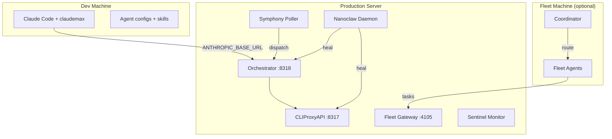
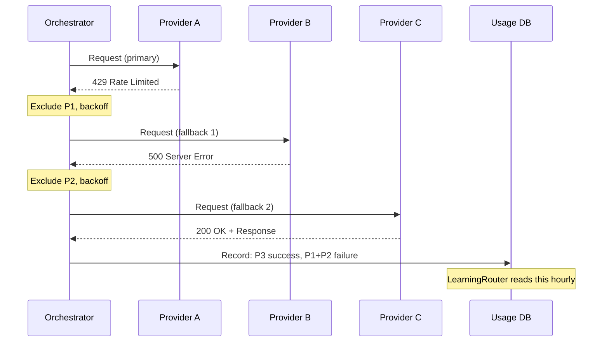

# Architecture

## Request Flow

```
┌─────────────────────────────────────────────────────────────────────┐
│  Agent Layer                                                         │
│  Claude Code · Codex CLI · Amp · Droid · OpenCode                   │
│  (each uses CLAUDE.md hooks, ~/.claude/rules/, loaded skills)        │
└───────────────────────┬─────────────────────────────────────────────┘
                        │ POST /v1/messages (Anthropic format)
                        │ ANTHROPIC_BASE_URL=http://localhost:8317
                        ▼
┌─────────────────────────────────────────────────────────────────────┐
│  claudemax wrapper (shell)                                           │
│  • Sets ANTHROPIC_BASE_URL → :8317                                   │
│  • Retries on ECONNREFUSED                                           │
│  • Falls back to direct Anthropic API if proxy unreachable           │
└───────────────────────┬─────────────────────────────────────────────┘
                        │
                        ▼
┌─────────────────────────────────────────────────────────────────────┐
│  CLIProxyAPI  :8317  (Go)                                            │
│  • Credential broker - OAuth tokens, API keys, per-provider headers  │
│  • Routes to Orchestrator for multi-provider dispatch                │
│  • Handles token refresh via Nanoclaw signals                        │
└───────────────────────┬─────────────────────────────────────────────┘
                        │
                        ▼
┌─────────────────────────────────────────────────────────────────────┐
│  Orchestrator  :8318  (Bun/TypeScript)                               │
│                                                                      │
│  classifyTier()                                                      │
│    opus-* → premium  |  sonnet-* → standard                          │
│    haiku-* → fast    |  explicit flag → budget                       │
│                                                                      │
│  analyzeContentComplexity()                                          │
│    tool_use count, prompt length, system prompt size                 │
│    → auto-upgrade standard → premium if complexity high              │
│                                                                      │
│  getNextRoute()                                                      │
│    LearningRouter weights (scored hourly from UsageDB)               │
│    excludes: parked accounts (>95% daily budget)                     │
│    excludes: failing providers (circuit open)                        │
│                                                                      │
│  translateModel()                                                    │
│    claude-sonnet-4-5 → claude-3-5-sonnet-20241022 (Anthropic)        │
│    claude-sonnet-4-5 → codex-5.2 (if Codex route)                   │
│    claude-opus-4   → gemini-2.0-flash (if Gemini route, degraded)   │
│                                                                      │
│  acquire semaphore (global:12, per-provider:4)                       │
│                                                                      │
│  provider.sendRequest()                                              │
│    premium timeout: 120s  |  standard: 60s  |  fast: 30s            │
│    streaming keepalive: 15s                                          │
│                                                                      │
│  on failure:                                                         │
│    exponential backoff → exclude provider → retry next route         │
│    after 3 consecutive failures: circuit open (5 min cooldown)       │
│                                                                      │
│  record → UsageDB (SQLite)                                           │
└───────────────────────┬─────────────────────────────────────────────┘
                        │
          ┌─────────────┼──────────────┬─────────────────┐
          ▼             ▼              ▼                  ▼
    ┌──────────┐  ┌──────────┐  ┌──────────┐    ┌──────────────┐
    │ Anthropic│  │  Codex   │  │  Gemini  │    │  GLM / other │
    │ (Claude) │  │  (OAI)   │  │  (GCP)   │    │  providers   │
    └──────────┘  └──────────┘  └──────────┘    └──────────────┘
```

## 9-Layer Model

| Layer         | Components                               | Purpose                                    |
| ------------- | ---------------------------------------- | ------------------------------------------ |
| Agent         | Claude Code, Codex, Droid, Amp, OpenCode | AI coding agents with hooks, rules, skills |
| Orchestration | Orchestrator (:8318)                     | Multi-provider routing, failover, budget   |
| Pipeline      | Fleet engine, stages, RALPH              | Multi-agent task execution                 |
| Dispatch      | Symphony, Fleet Gateway (:4105)          | Issue tracking to agent assignment         |
| Auth          | CLIProxyAPI (:8317)                      | Central credential broker                  |
| Provider      | Claude, Codex, Gemini, GLM, etc.         | LLM API endpoints                          |
| Memory        | SQLite usage DB, learning state          | Cross-session persistence                  |
| Self-Healing  | Nanoclaw daemon                          | Token refresh, health monitoring           |
| Monitoring    | Sentinel, health checks                  | Watchdog and auto-remediation              |

## Cross-Machine Topology



## Cross-Provider Translation

| Concern         | Anthropic format                                  | Translated to                                           |
| --------------- | ------------------------------------------------- | ------------------------------------------------------- |
| Messages format | `role: user/assistant`, `content: [{type: text}]` | OpenAI `messages` array (Codex, Gemini)                 |
| Tool calls      | `type: tool_use`, `type: tool_result`             | OpenAI `tool_calls`, `tool` role messages               |
| Model names     | `claude-sonnet-4-5`                               | `codex-5.2` / `gemini-2.0-flash` per route              |
| Thinking blocks | `type: thinking`, `thinking: "..."`               | Stripped (unsupported providers) or mapped to reasoning |
| Streaming       | `event: content_block_delta` SSE                  | OpenAI `data: {"choices":[...]}` SSE                    |
| Stop reason     | `end_turn`, `tool_use`                            | `stop`, `tool_calls`                                    |

Translation is bidirectional - responses are normalized back to Anthropic format before
returning to the agent.

## LaunchAgent Topology

```
launchd (macOS)
├── com.claudemax.orchestrator.plist    → bun run services/orchestrator/src/index.ts
│     KeepAlive: true, ThrottleInterval: 30
├── com.ai.fleet.gateway.plist          → fleet gateway :4105
│     KeepAlive: true
├── com.nanoclaw.daemon.plist           → python3 services/nanoclaw/daemon.py
│     KeepAlive: true, StartInterval: 300
└── com.ai.token-sync.plist             → scripts/sync-tokens.sh
      StartCalendarInterval: hourly
```

CLIProxyAPI is managed separately as a Homebrew service (`brew services start cliproxyapi`).

## Fleet Pipeline Stages

```
plan → spec → design → implement → test → fix → review → merge → deploy → verify → cleanup
                                    ↑__________________________|
                                         RALPH loop
                                    test fail → fix → test
                                    review fail → implement → test → fix → review
```

`cycle_count` managed exclusively by `_ralph_loop_reset()` in `fleet/pipeline/engine.py`.
RALPH stages use `stage_order` 1000 + cycle \* 100 to sort after base stages.

## Resilience Features

| Feature             | Mechanism                              | Config                                               |
| ------------------- | -------------------------------------- | ---------------------------------------------------- |
| Retry on failure    | Exponential backoff, exclude-and-retry | max 3 attempts per request                           |
| Concurrency control | Semaphores per provider + global       | global:12, per-provider:4                            |
| Per-tier timeouts   | Separate timeout per tier class        | premium:120s, standard:60s, fast:30s                 |
| Circuit breaker     | Provider excluded after N failures     | 3 consecutive → 5 min cooldown                       |
| Budget guard        | Daily token ceiling per account        | park at 95%, reset at midnight                       |
| Token refresh       | Nanoclaw PKCE refresh before expiry    | monitors 5 min before TTL                            |
| Streaming keepalive | Periodic SSE comment frames            | every 15s                                            |
| Bootstrap retries   | Orchestrator restart on boot failure   | 2 retries, 30s ThrottleInterval                      |
| Adaptive scoring    | LearningRouter hourly re-score         | success 40%, availability 25%, latency 20%, cost 15% |
| Watchdog            | LaunchAgent KeepAlive + Nanoclaw       | auto-restart on crash, health probe every 5 min      |

## Provider Failover Sequence


