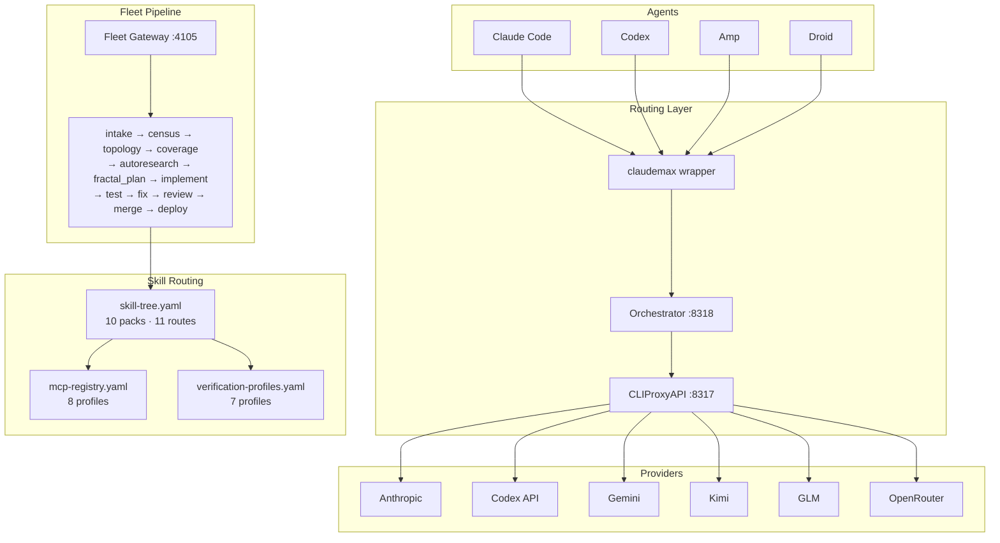
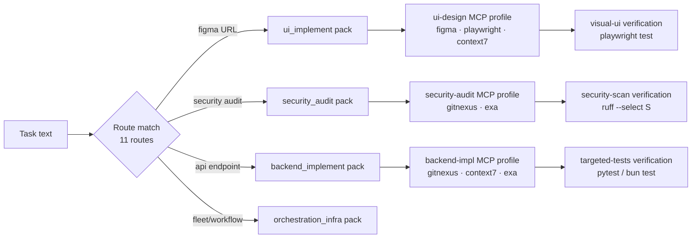
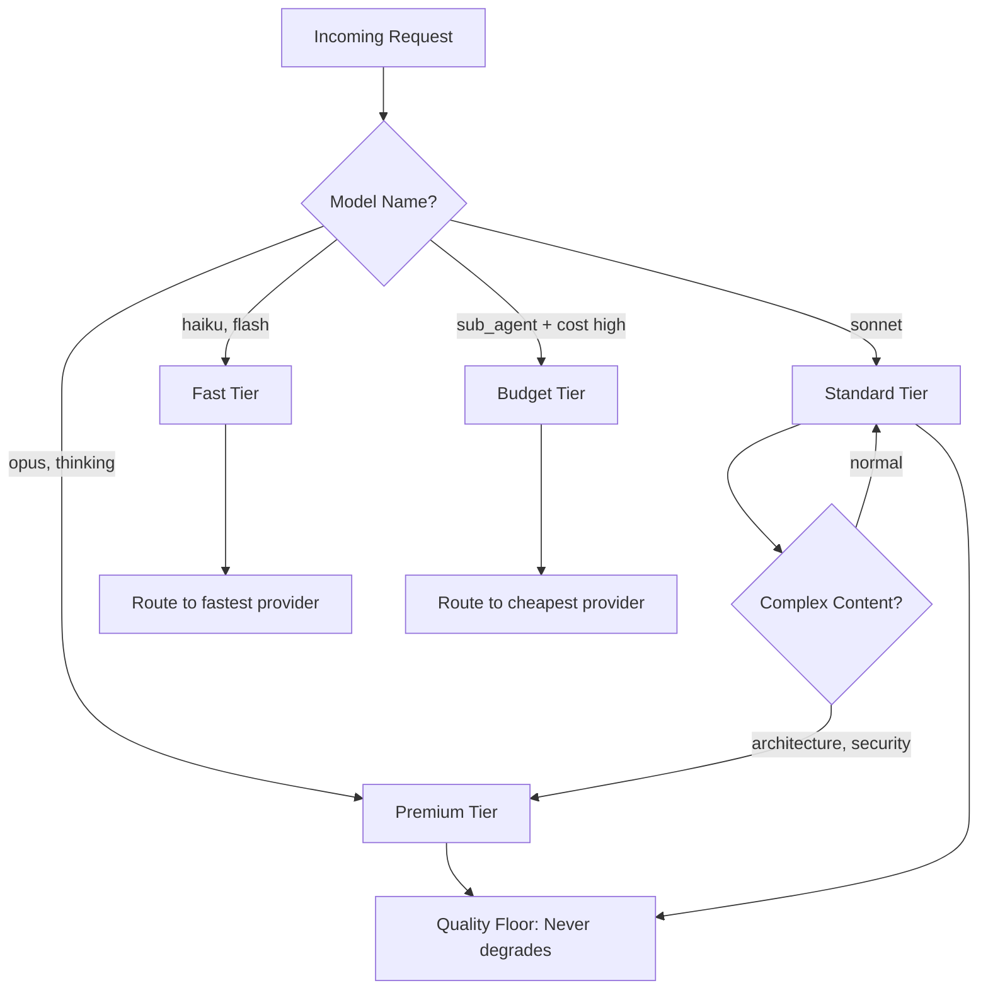

# fullstackOS

Infrastructure for running AI coding agents (Claude Code, Codex, Amp, Droid) continuously at scale — smart routing, multi-provider failover, skill-aware dispatch, and a self-correcting fleet pipeline.

## The Problem

AI coding agents depend on a single LLM provider. When that provider rate-limits, goes down, or exhausts your OAuth token allowance, the session dies mid-task. For short sessions this is annoying. For 8+ hour autonomous runs — multi-file refactors, test generation sweeps, fleet dispatches — it means lost work, broken pipelines, and manual restarts.

Token exhaustion is not uniform. Claude OAuth tokens run out faster than API keys. Gemini has daily quotas. Codex throttles on concurrent requests. Running multiple agents in parallel guarantees you will hit at least one limit within the first few hours. The naive fix — switching providers manually — breaks tool call formatting, model name expectations, and streaming behavior that agents depend on.

The deeper problem is that no single provider is reliable enough to be the sole backend for a production agent fleet. Providers have correlated outage windows, undocumented rate limits, and per-account token ceilings that don't scale with usage. A routing layer that treats providers as interchangeable, penalizes degraded ones, and translates protocol differences is the missing infrastructure piece.

## Architecture



### Request Flow

```
POST /v1/messages → Orchestrator (:8318)
  → classifyTier()              # opus→premium, sonnet→standard, haiku→fast
  → analyzeContentComplexity()  # complex prompts auto-upgrade tier
  → getNextRoute()              # budget-aware, penalizes quota-exhausted accounts
  → translateModel()            # claude-sonnet → codex-5.4 (if codex route)
  → acquire semaphore           # global:12, per-provider:4
  → provider.sendRequest()      # per-tier timeout: premium:120s / fast:30s
  → on failure: backoff → exclude provider → retry next route
  → record in UsageDB           # feeds LearningRouter hourly scoring
```

CLIProxyAPI (:8317) is the credential broker — holds OAuth tokens, handles refresh, exposes provider-specific auth headers. Agents never touch credentials directly.

## What's Included

| Component             | Tech           | What It Does                                                 |
| --------------------- | -------------- | ------------------------------------------------------------ |
| Orchestrator          | Bun/TypeScript | Tier routing, failover, token management, budget enforcement |
| CLIProxyAPI           | Go (Homebrew)  | OAuth token storage, refresh, multi-provider auth            |
| Fleet Pipeline        | Python         | 18-stage pipeline with fractal decomposition + RALPH loops   |
| Symphony              | Python         | Issue tracker polling → complexity-routed agent dispatch     |
| Nanoclaw              | Python         | Self-healing daemon, token refresh, health monitoring        |
| Sentinel              | Python         | Health checks, watchdog, auto-remediation playbooks          |
| Skill Tree            | YAML           | 10 skill packs, 11 routes, phrase + regex matching           |
| MCP Registry          | YAML           | 8 profiles mapping task types to MCP server sets             |
| Verification Profiles | YAML           | 7 profiles specifying how agents prove their work            |
| claudemax             | Shell          | Proxy-first CLI wrapper with ECONNREFUSED recovery           |
| 146 tests             | pytest         | Pipeline, budget, e2e harness, sentinel                      |

## FleetMax Pipeline

The fleet pipeline has 18 dispatched stages organized into two phases:

**Zero-cost planning phase** (no LLM calls until `fractal_plan`):

```
intake → refine → research → spec → plan
       ↳ census (repo file graph)
       ↳ topology (import/dependency graph)
       ↳ coverage (gap analysis)
       ↳ autoresearch (background doc fetch)
       ↳ fractal_plan (LLM decomposes into task tree)
```

**Execution phase** with RALPH self-correction:

```
issues → implement → test → fix → review → merge → deploy → adversarial → cleanup
                      ↑_______________|
                           RALPH loop
                      test fail → fix → test
                      review fail → implement → test → fix → review
```

Self-update stages (plan_self_update → validate → apply) allow the pipeline to patch itself between runs.

`cycle_count` is managed exclusively by `_ralph_loop_reset()` in `fleet/pipeline/engine.py`. RALPH stages use `stage_order` 1000 + cycle × 100 to sort after base stages.

### Skill-Aware Agent Dispatch

When `fractal_plan` decomposes an objective into leaf tasks, each task is routed through `skill-tree.yaml`:

1. Task text is matched against 11 routes (phrase + regex) → highest priority wins
2. Matched route maps to a **skill pack** (10 defined: `orchestration_infra`, `ui_implement`, `backend_implement`, `security_audit`, etc.)
3. Skill pack specifies: `preferred_cli`, `preferred_model`, `mcp_profile`, `verification_profile`, and skill list
4. Agent is spawned with that CLI+model, MCP servers pre-loaded, and verification commands embedded in its prompt



## Skill System

### skill-tree.yaml

Routes tasks to skill packs via priority-ordered phrase and regex matching:

| Pack                  | CLI    | Model               | MCP Profile    | Verification Profile  |
| --------------------- | ------ | ------------------- | -------------- | --------------------- |
| orchestration_infra   | codex  | gpt-5.4             | —              | pipeline-orchestrator |
| ui_implement          | codex  | gpt-5.4             | ui-design      | visual-ui             |
| ui_review             | claude | claude-opus-4-6     | ui-design      | visual-ui-review      |
| ui_assets_motion      | gemini | gemini-3.1-pro-high | browser-debug  | motion-ui             |
| backend_implement     | codex  | gpt-5.4             | backend-impl   | targeted-tests        |
| security_audit        | claude | claude-opus-4-6     | security-audit | security-scan         |
| research_deep         | claude | claude-opus-4-6     | full-research  | targeted-tests        |
| test_strategy         | codex  | gpt-5.2             | lean-default   | targeted-tests        |
| product_design_router | claude | claude-opus-4-6     | —              | product-design-router |
| docs_theorist         | claude | claude-opus-4-6     | —              | theorist-docs         |

### mcp-registry.yaml

8 profiles mapping to MCP server subsets:

| Profile        | Servers                     |
| -------------- | --------------------------- |
| lean-default   | figma, context7, gitnexus   |
| ui-design      | figma, playwright, context7 |
| core-research  | context7, exa, gitnexus     |
| full-research  | context7, exa, gitnexus     |
| backend-impl   | gitnexus, context7, exa     |
| security-audit | gitnexus, exa               |
| browser-debug  | playwright, chrome-devtools |
| deploy-verify  | gitnexus                    |

### verification-profiles.yaml

7 profiles telling agents how to prove their work:

| Profile               | Command                                                     |
| --------------------- | ----------------------------------------------------------- |
| targeted-tests        | `pytest tests/ -x -q --tb=short` / `bun test`               |
| pipeline-orchestrator | `cd fleet && python3 -m pytest ../tests/ -x -q`             |
| visual-ui             | `npx playwright test --reporter=line`                       |
| theorist-docs         | `python3 scripts/theorist/validate.py --root docs/theorist` |
| security-scan         | `ruff check --select S {files}` + eslint no-eval            |
| product-design-router | `pytest tests/ -x -q -k product`                            |
| motion-ui             | `npx playwright test --reporter=line`                       |

## Quick Start

```bash
git clone https://github.com/your-org/fullstackOS.git
cd fullstackOS
brew bundle
./scripts/install.sh --all
```

Auth (browser-based OAuth per provider):

```bash
cliproxyapi --claude-login
cliproxyapi --codex-login
cliproxyapi --gemini-login
```

Verify:

```bash
./scripts/install.sh --doctor
```

The doctor check hits health endpoints on `:8317`, `:8318`, and `:4105` and reports any misconfigured credentials or missing LaunchAgents.

## Config Files

Three YAML files in `config/` drive skill-aware dispatch:

| File                                | Purpose                                               |
| ----------------------------------- | ----------------------------------------------------- |
| `config/skill-tree.yaml`            | Routes tasks to skill packs via phrase/regex matching |
| `config/mcp-registry.yaml`          | Maps MCP profile names to server sets                 |
| `config/verification-profiles.yaml` | Maps profile names to verification commands           |

Skill packs reference both an `mcp_profile` and a `verification_profile` by name. The fractal planner reads `skill-tree.yaml` at dispatch time to select the right CLI, model, MCP servers, and verification command for each decomposed task.

## Directory Map

```
fullstackOS/
├── services/
│   ├── orchestrator/       # Bun/TypeScript routing engine
│   │   └── src/
│   │       ├── fleet/      # fractal-planner.ts, swarm.ts, skill-resolver.ts
│   │       ├── router/     # task-router.ts, learning-router.ts, routing-policy.ts
│   │       └── sandbox/    # harness-client.ts, gateway-adapter.ts
│   ├── cliproxyapi/        # Go credential broker
│   ├── symphony/           # Issue tracker poller + dispatcher
│   └── nanoclaw/           # Self-healing daemon
├── fleet/
│   └── pipeline/           # engine.py, stages.py, agents.py
│       ├── census.py       # Repo file graph builder
│       ├── topology.py     # Import/dependency graph builder
│       ├── skill_injection.py
│       └── quality_gates.py
├── config/
│   ├── skill-tree.yaml     # 10 skill packs, 11 routes
│   ├── mcp-registry.yaml   # 8 MCP profiles
│   └── verification-profiles.yaml  # 7 verification profiles
├── coordinator/            # ai_coordinator.py, task classification
├── modules/
│   └── sentinel/           # Health checks, auto-remediation
├── agents/                 # Agent configs, hooks, rules
├── skills/                 # Skill behavior templates (9 skills)
│   ├── budget-check/
│   ├── experiment-loop/
│   ├── fleet/
│   ├── fractal-planner/
│   ├── pipeline/
│   ├── swarm/
│   ├── tdd-agent/
│   ├── verify-impl/
│   └── worktree-manager/
├── tests/                  # pytest suite (146 tests)
├── launchd/                # LaunchAgent plists
├── scripts/                # install.sh, doctor, token sync
├── Brewfile
└── Makefile
```

## Documentation

### Architecture & Core Systems

| Doc                                                                      | Contents                                          |
| ------------------------------------------------------------------------ | ------------------------------------------------- |
| [ARCHITECTURE.md](ARCHITECTURE.md)                                       | 9-layer model, request flow, resilience table     |
| [SETUP.md](SETUP.md)                                                     | Step-by-step replication guide                    |
| [TRADEOFFS.md](TRADEOFFS.md)                                             | Design decisions: sync vs async, cost, complexity |
| [00 - Why Multi-Provider](docs/00-why-multi-provider.md)                 | The economics of provider redundancy              |
| [01 - Request Lifecycle](docs/01-request-lifecycle.md)                   | Trace a request end-to-end through the stack      |
| [02 - Tier Routing](docs/02-tier-routing.md)                             | Premium/standard/fast/budget classification       |
| [03 - Learning Router](docs/03-learning-router.md)                       | Adaptive hourly provider reordering               |
| [04 - Fleet Pipeline](docs/04-fleet-pipeline.md)                         | 18 stages + RALPH self-correction loops           |
| [05 - Self-Healing](docs/05-self-healing.md)                             | Nanoclaw daemon + watchdog patterns               |
| [10 - Cross-Provider Translation](docs/10-cross-provider-translation.md) | Tool calls, model names, streaming across APIs    |

### Setup & Operations

| Doc                                                                    | Contents                                                         |
| ---------------------------------------------------------------------- | ---------------------------------------------------------------- |
| [11 - Modular Install](docs/11-modular-install.md)                     | 4-tier setup: solo → power user → team lead → full autonomous    |
| [12 - claudemax Optimization](docs/12-claudemax-optimization.md)       | Auth isolation, recovery flow, doctor command                    |
| [13 - Skill Trees](docs/13-skill-trees.md)                             | Skill taxonomy, composition patterns, auto-triggers              |
| [14 - Symphony Setup](docs/14-symphony-setup.md)                       | Linear integration for autonomous agent dispatch                 |
| [15 - Interactive vs Autonomous](docs/15-autonomous-vs-interactive.md) | When to pair-program vs dispatch vs automate                     |
| [16 - Memory System](docs/16-memory-system.md)                         | 5-layer memory: session, coordinator, usage, aura, skill metrics |

### Quality & Reliability

| Doc                                                      | Contents                                              |
| -------------------------------------------------------- | ----------------------------------------------------- |
| [06 - Skill System](docs/06-skill-system.md)             | How skills work as agent behavior templates           |
| [07 - Agent Configs](docs/07-agent-configs.md)           | Multi-agent setup: Claude Code, Codex, Droid, Amp     |
| [08 - Symphony Dispatch](docs/08-symphony-dispatch.md)   | Issue tracking → complexity-routed agent dispatch     |
| [09 - Budget Enforcement](docs/09-budget-enforcement.md) | Daily limits, account parking, cost control           |
| [17 - Evals & Testing](docs/17-evals-and-testing.md)     | Test strategy, eval harness, CI pipeline              |
| [18 - Known Bugs](docs/18-known-bugs-and-edge-cases.md)  | War stories: bugs found, fixed, and still lurking     |
| [19 - System Diagrams](docs/19-diagrams.md)              | Mermaid diagrams: architecture, flows, state machines |

## Key Design Decisions

- **Tier-based routing**: premium / standard / fast / budget with a quality floor. Premium requests never degrade to fast-tier providers. Tier is set by model name and can be upgraded by complexity analysis.



- **Adaptive learning**: `LearningRouter` reads 24h usage data hourly and scores providers on success rate (40%), availability (25%), latency (20%), cost (15%). Scores feed `getNextRoute()` weight selection.

- **RALPH loops**: Retry-Adjust-Loop-Patch-Heal self-correction embedded in fleet pipelines. Test failures trigger `fix → test` cycles; review failures trigger `review → implement → test → fix → review → merge → deploy`.

- **Budget guard**: Per-provider daily token limits. Accounts are parked at 95% of their ceiling and excluded from routing until the next reset window.

- **Cross-provider translation**: Tool calls, model names, thinking blocks, and streaming format are translated transparently. Agents emit Anthropic-format requests; the Orchestrator handles the rest.

- **Token isolation**: OAuth tokens are stored per-account in CLIProxyAPI with an expiry tracker. Nanoclaw daemon monitors expiry and triggers PKCE refresh before sessions fail.

- **Zero-cost planning**: `census` and `topology` stages build a complete repo model (file graph + import graph) before any LLM call. `fractal_plan` receives this graph and decomposes the objective into a task tree with dependency ordering — the most expensive decision made cheaply upfront.
