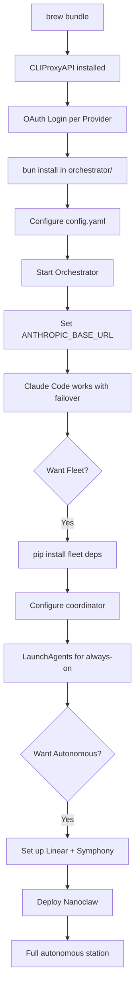

# Setup Guide

Step-by-step replication for the fullstackOS routing and fleet stack.

---

## Prerequisites

- macOS 13+ (Ventura or later)
- Homebrew: `brew --version` → 4.x+
- Bun: `curl -fsSL https://bun.sh/install | bash`
- Python 3.11+: `brew install python@3.11`
- Xcode CLI tools: `xcode-select --install`

---

## 1. Install CLIProxyAPI

```bash
# Via Homebrew (if tap available)
brew tap your-org/tools && brew install cliproxyapi

# Or build from source
git clone https://github.com/your-org/cliproxyapi && cd cliproxyapi
go build -o cliproxyapi . && sudo mv cliproxyapi /usr/local/bin/
```

Verify: `cliproxyapi --version`

---

## 2. Configure Providers

OAuth-based providers (browser login required):

```bash
cliproxyapi auth login claude      # Anthropic Claude
cliproxyapi auth login codex       # OpenAI Codex
cliproxyapi auth login gemini      # Google Gemini
cliproxyapi auth login antigravity # Antigravity
cliproxyapi auth login kimi        # Kimi (Moonshot)
```

API key providers (add to `services/cliproxyapi/config.yaml`):

```yaml
providers:
  glm:
    api_key: "${GLM_API_KEY}"
  minimax:
    api_key: "${MINIMAX_API_KEY}"
  openrouter:
    api_key: "${OPENROUTER_API_KEY}"
```

Export keys in your shell profile:

```bash
export GLM_API_KEY=your_key
export MINIMAX_API_KEY=your_key
export OPENROUTER_API_KEY=your_key
```

---

## 3. Install Orchestrator

```bash
cd services/orchestrator
bun install
bun run build
```

Verify: `ls dist/index.js`

---

## 4. Configure Routing

Edit `services/orchestrator/config.yaml`:

```yaml
port: 8318
cliproxyapi_url: http://localhost:8317

tiers:
  fast:
    providers: [claude-haiku, gemini-flash, kimi-fast]
  standard:
    providers: [claude-sonnet, codex-medium, gemini-pro]
  long_context:
    providers: [claude-opus, gemini-ultra, kimi-long]

learning_router:
  enabled: true
  window_hours: 24
  reorder_interval_minutes: 60
```

Provider overrides (optional, pins a provider regardless of LearningRouter scores):

```yaml
provider_overrides:
  standard: claude-sonnet # always try this first for standard tier
```

---

## 5. Set Up LaunchAgents

```bash
# Copy plists
cp launchd/*.plist ~/Library/LaunchAgents/

# Load all services
launchctl load ~/Library/LaunchAgents/ai.cliproxyapi.plist
launchctl load ~/Library/LaunchAgents/ai.orchestrator.plist
launchctl load ~/Library/LaunchAgents/ai.fleet.gateway.plist

# Verify
launchctl list | grep ai\.
```

Expected output: all three labels listed with PID (not `-`).

---

## 6. Install Fleet

```bash
cd fleet
pip3.11 install -r requirements.txt

# Verify imports
python3 -c "from pipeline.engine import PipelineEngine; print('ok')"
```

---

## 7. Point Claude Code at Orchestrator

Add to your shell profile (`~/.zshrc` or `~/.bash_profile`):

```bash
export ANTHROPIC_BASE_URL=http://localhost:8318
export ANTHROPIC_API_KEY=your-proxy-key
```

Reload: `source ~/.zshrc`

---

## 8. Verify

```bash
# Health check
curl http://localhost:8317/health   # CLIProxyAPI
curl http://localhost:8318/health   # Orchestrator

# Full doctor check
./scripts/install.sh --doctor
```

Expected CLIProxyAPI health response:

```json
{ "status": "ok", "providers": 8, "accounts": 20 }
```

Expected Orchestrator health response:

```json
{ "status": "ok", "routing": "adaptive", "uptime_seconds": 42 }
```

---

## 9. Optional: Nanoclaw Self-Healing Daemon

```bash
cp launchd/ai.nanoclaw.plist ~/Library/LaunchAgents/
launchctl load ~/Library/LaunchAgents/ai.nanoclaw.plist

# Verify it's running
launchctl list | grep nanoclaw
tail -f ~/.nanoclaw/actions.log
```

Nanoclaw monitors CLIProxyAPI + Orchestrator, auto-refreshes OAuth tokens on 401s, and sends Telegram alerts on escalation.

---

## 10. Optional: Symphony Poller + Sentinel

```bash
# Symphony (Linear issue → pipeline dispatch)
cp launchd/ai.symphony.plist ~/Library/LaunchAgents/
launchctl load ~/Library/LaunchAgents/ai.symphony.plist

# Sentinel monitoring
cp launchd/ai.sentinel.plist ~/Library/LaunchAgents/
launchctl load ~/Library/LaunchAgents/ai.sentinel.plist
```

Requires `LINEAR_API_KEY` and `TELEGRAM_BOT_TOKEN` in your environment.

---

## Installation Flow



---

## Troubleshooting

| Symptom                    | Check                                                                                                     |
| -------------------------- | --------------------------------------------------------------------------------------------------------- |
| `curl :8318/health` fails  | `launchctl list \| grep orchestrator` - PID = `-` means crash. Check `~/Library/Logs/ai.orchestrator.log` |
| 401 from provider          | `cliproxyapi auth status` - token may be expired. Run `cliproxyapi auth refresh <provider>`               |
| LearningRouter oscillating | Set `provider_overrides` in config.yaml to pin stable provider temporarily                                |
| Fleet pipeline stuck       | Check `MAX_RETRIES` env var - default 3. Check `~/.ai-fleet/coordinator/memory.db` for stuck tasks        |
