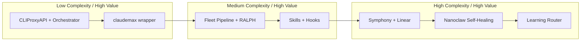

# Architecture Tradeoffs

Decision log for the fullstackOS routing and fleet architecture.

---

## 1. Sync vs Async Routing

**Options:**

- Synchronous request proxying: client sends request, orchestrator forwards to provider, streams response back
- Async queue: client enqueues, orchestrator dispatches, client polls for result

**Tradeoffs:**

| Factor             | Sync                         | Async                              |
| ------------------ | ---------------------------- | ---------------------------------- |
| SSE streaming      | Native - no special handling | Requires reconstruction or polling |
| Client retry logic | Client controls backoff      | Orchestrator controls retry        |
| Latency            | No queue overhead            | Queue adds 100–500ms               |
| Batch throughput   | Poor - blocks per request    | Excellent                          |
| Failure visibility | Immediate to client          | Hidden until poll                  |

**Decision:** Sync for interactive Claude Code / chat sessions (preserves streaming SSE, client sees failures immediately). Async for fleet dispatch (pipeline stages, batch jobs) where streaming is irrelevant and throughput matters.

```mermaid
quadrantChart
    title Routing Strategy Decision
    x-axis Low Latency --> High Throughput
    y-axis Simple --> Complex
    quadrant-1 Async Queue (Fleet)
    quadrant-2 Hybrid (Current)
    quadrant-3 Direct API (No proxy)
    quadrant-4 Sync Proxy (Interactive)
```

---

## 2. Single Proxy vs Multiple Endpoints

**Options:**

- Single Anthropic-compatible endpoint at `:8318` - all clients point here
- Per-provider endpoints - clients specify `openai://`, `anthropic://`, etc.

**Tradeoffs:**

| Factor           | Single Endpoint                       | Multi-Endpoint                 |
| ---------------- | ------------------------------------- | ------------------------------ |
| Client config    | One `ANTHROPIC_BASE_URL`              | Per-provider config per client |
| Failover         | Transparent                           | Client must implement          |
| Provider lock-in | None                                  | Client couples to provider API |
| Debugging        | Harder to trace which provider served | Obvious                        |

**Decision:** Single endpoint. Claude Code, fleet agents, and every other client set `ANTHROPIC_BASE_URL=http://localhost:8318`. Failover, load balancing, and provider translation are fully invisible to clients.

---

## 3. Cost vs Reliability (Provider Count)

**Options:** 2 providers (simple) → 8 providers (current) → 15+ providers (maximum redundancy)

**Tradeoffs:**

| Provider count | Reliability                            | Integration cost | Token management                     |
| -------------- | -------------------------------------- | ---------------- | ------------------------------------ |
| 2              | Low - single point of failure per tier | Low              | Trivial                              |
| 8              | High - multiple fallbacks per tier     | Medium           | 8 OAuth flows, 8 rate limit trackers |
| 15+            | Marginal gain over 8                   | High             | Unsustainable refresh cycle          |

**Decision:** 8 providers is the sweet spot. Claude + Codex + Gemini + Antigravity + Kimi + GLM + MiniMax + OpenRouter covers every tier (fast/standard/long-context) with at least 2 fallbacks per tier. Beyond 8, each new provider adds integration maintenance cost with diminishing reliability gains.

---

## 4. Adaptive vs Static Routing

**Options:**

- Static: config file defines provider order, never changes at runtime
- Adaptive: LearningRouter reorders priorities hourly based on real latency/error data

**Tradeoffs:**

| Factor            | Static                         | Adaptive                                            |
| ----------------- | ------------------------------ | --------------------------------------------------- |
| Predictability    | High                           | Lower - priorities shift                            |
| Oscillation risk  | None                           | Present - provider recovers but stays deprioritized |
| Stale config risk | High - human forgets to update | None                                                |
| Debuggability     | Easy                           | Requires inspecting runtime state                   |

**Oscillation risk mitigation:**

- 24-hour rolling window for scoring (single bad hour doesn't crater a provider)
- Weighted scoring: error rate (40%) + p95 latency (40%) + success rate (20%)
- Manual override: `provider_overrides` in `config.yaml` pins a provider to top regardless of scores
- Floor: no provider drops below position 6 (stays in pool for recovery observation)

**Decision:** Adaptive. Static configs go stale as provider reliability shifts. The 24h window and manual override cover the oscillation case.

---

## 5. Fleet Pipeline Complexity

**Options:**

- Simple 3-stage: `plan → implement → review`
- Full 12-stage with RALPH self-correction loops

**Full pipeline stages:** `spec → plan → design → implement → test → fix → review → security → performance → document → deploy → monitor`

**Tradeoffs:**

| Factor              | 3-stage                  | 12-stage                           |
| ------------------- | ------------------------ | ---------------------------------- |
| Time per task       | Fast                     | 3–5x slower                        |
| Output quality      | Adequate for simple bugs | Required for production features   |
| RALPH loop overhead | N/A                      | +1–3 cycles when tests/review fail |
| Stage skip support  | N/A                      | Yes - pipeline type configs        |

**Stage skip configs (pipeline types):**

| Type       | Skipped stages                            |
| ---------- | ----------------------------------------- |
| `bugfix`   | spec, plan, design, document              |
| `hotfix`   | spec, plan, design, document, performance |
| `feature`  | none (full pipeline)                      |
| `refactor` | spec, security, deploy                    |

**Decision:** Full pipeline for production work. Pipeline type configs make it equivalent to 3-stage for simple tasks while retaining the full path for features. RALPH loops are bounded at `MAX_RETRIES=3`.

---

## 6. Self-Healing vs Manual Ops

**Options:**

- Manual: operator refreshes tokens, restarts services on failure
- Nanoclaw daemon: auto-refreshes OAuth tokens, auto-restarts degraded services

**Tradeoffs:**

| Factor               | Manual                      | Nanoclaw                                            |
| -------------------- | --------------------------- | --------------------------------------------------- |
| MTTR on token expiry | Hours (human response time) | Minutes                                             |
| Failure masking risk | None                        | Present - bad state auto-recovered hides root cause |
| Audit trail          | None unless operator logs   | All actions written to `~/.nanoclaw/actions.log`    |
| Runaway risk         | None                        | Auto-restart loop if root cause is crash-on-start   |

**Masking mitigation:**

- Every action logged with timestamp, service, action type, outcome
- Telegram alert for any action taken (Sentinel channel)
- Escalation threshold: 3 restarts within 10 minutes → alert + backoff, no further auto-action
- Token refresh logged separately from service restarts - distinguishable in audit

**Decision:** Self-healing. Token expiry at 3 AM with no auto-refresh kills fleet autonomy. The escalation threshold and audit trail cover the masking risk.

---

## 7. Skills as Prompt Templates vs Code Plugins

**Options:**

- Markdown skill files injected into agent system prompt
- Executable plugin code (Python/TS modules) invoked by orchestrator

**Tradeoffs:**

| Factor          | Markdown                                     | Code plugins                |
| --------------- | -------------------------------------------- | --------------------------- |
| Safety          | High - no execution surface                  | Lower - arbitrary code runs |
| Iteration speed | Edit file, reload session                    | Edit + redeploy + test      |
| Power           | Limited to what LLM can do with instructions | Full programmatic control   |
| Failure mode    | LLM ignores instructions                     | Code throws exception       |

**Decision:** Markdown for behavior shaping (personas, workflows, domain knowledge). Code only for pipeline stage implementations where programmatic control is required (e.g., `stage_implement`, `stage_test`). Skills are never executed - they are context injected at session start.



---

## 8. macOS LaunchAgents vs Docker

**Options:**

- macOS LaunchAgents: native service management, plist files, `launchctl`
- Docker Compose: containerized, portable, restarts on failure

**Tradeoffs:**

| Factor             | LaunchAgents                   | Docker                                    |
| ------------------ | ------------------------------ | ----------------------------------------- |
| macOS portability  | Native                         | Requires Docker Desktop (VM overhead)     |
| Linux portability  | Requires adaptation            | Drop-in                                   |
| Resource overhead  | Minimal                        | ~500MB for Docker daemon                  |
| File system access | Direct                         | Volume mounts needed for credential files |
| Restart behavior   | KeepAlive in plist             | `restart: unless-stopped`                 |
| ThrottleInterval   | Yes - prevents respawn cascade | No native equivalent                      |

**Decision:** LaunchAgents for macOS-only fleet. The architecture is container-ready (all services read config from environment variables, no hardcoded paths to macOS-specific locations) but the native approach eliminates VM overhead and simplifies credential access from `~/.claude/`, `~/.agent-gateway/`, and `~/.messaging-gateway/`.
