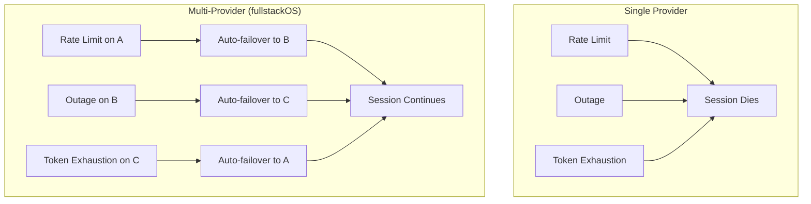

# Why Multi-Provider LLM Routing

## The Problem

Single-provider AI coding setups fail in predictable ways:

- **Rate limits**: Claude Pro has per-hour and per-day token limits. Hit them mid-session and you stall.
- **Service outages**: Every provider has incidents. When Anthropic's API degrades, all your work stops.
- **Token exhaustion**: One large codebase context dump can consume hours of quota in minutes.
- **Account limits**: Even paid tiers have hard ceilings that cannot be raised on demand.

The failure mode is not "the AI gives bad answers" - it is "the AI gives no answers at all."



## The Insight: Complementary Failure Modes

Providers don't fail at the same time or for the same reasons:

| Provider           | Primary Failure Pattern                                     |
| ------------------ | ----------------------------------------------------------- |
| Anthropic (Claude) | Rate-limits on sustained high-throughput usage              |
| OpenAI (Codex)     | Intermittent API degradation, quota per billing cycle       |
| Google (Gemini)    | Per-minute request caps, daily quota resets at midnight UTC |
| GLM / ZhipuAI      | Generous free tier, but slower response times               |

A request that gets rate-limited by Anthropic at 2pm will almost certainly succeed via Gemini. The
providers' quota windows, maintenance schedules, and traffic peaks don't overlap uniformly. This
is the arbitrage multi-provider routing exploits.

## The Economics

A single Claude Pro subscription gives roughly 45 minutes of continuous Opus-level usage before
rate limits kick in. The math changes sharply when you add accounts and providers:

```
1 Claude Pro account    = ~45 min uninterrupted Opus
5 Claude accounts       = ~3.75 hrs (round-robin across accounts)
+ Codex standard quota  = +1.5 hrs equivalent
+ Gemini Flash (free)   = +3 hrs lightweight tasks
+ GLM free tier         = +2 hrs budget tasks

Total coverage          = 8+ hrs uninterrupted coding session
```

The per-request cost doesn't change. The availability does. You're not getting cheaper AI - you're
removing the ceiling.

## The Complexity Cost

This approach isn't free. Each provider adds:

- **Auth management**: OAuth tokens, API keys, refresh logic - each expires differently
- **Model translation**: Claude's `claude-opus-4-5` maps to different names across providers
- **Error handling**: Each provider has its own error codes, retry semantics, quota signals
- **Response normalization**: OpenAI-compatible vs Anthropic-native response formats differ
- **Monitoring**: You need visibility into which accounts are healthy vs exhausted

Without a routing layer, managing this manually across 5+ providers becomes a full-time job.
The orchestrator exists precisely to make this complexity invisible to the client.

## Who Needs This

This architecture targets power users running extended AI coding sessions:

- **8+ hours/day** of AI-assisted development
- Multiple concurrent AI agents (fleet pipelines, parallel research)
- Sessions that cannot tolerate interruption (deployment pipelines, long refactors)
- Cost-conscious users who want to maximize existing subscriptions before paying more

If you use AI coding tools for an hour a day, a single account is fine. If you're running
autonomous agents overnight or doing 6-hour uninterrupted refactors, you need routing.

## The Alternative

The alternative is manual fallback: when Claude hits a limit, you switch to the OpenAI website,
copy your context, and continue. This costs 5-10 minutes every time it happens, breaks your flow,
and loses conversation history. At 8 hours of usage, rate limits hit 3-5 times per day.

Automated routing converts a 5-minute interruption into a 2-second transparent retry.
