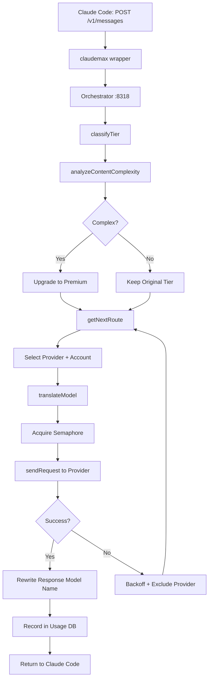

# Request Lifecycle

Trace a single `POST /v1/messages` from Claude Code through the full stack.

## Flow Diagram

```
Claude Code (client)
    |
    | POST /v1/messages  (ANTHROPIC_BASE_URL=http://localhost:8318)
    v
Orchestrator :8318
    |
    |-- classifyTier(model)
    |-- analyzeContentComplexity(prompt)  [may upgrade tier]
    |-- getNextRoute(tier)                [budget-aware selection]
    |-- translateModel(model, provider)
    |-- acquire semaphore (global:12, per-provider:4)
    |
    v
Provider API (Anthropic / Gemini / Codex / GLM)
    |
    |-- success --> rewrite response model name --> return to client
    |-- failure --> backoff --> exclude provider --> retry with next
    |
    v
UsageDB (records: account, tokens, latency, success)
    |
    v
LearningRouter (hourly: reorders tier priorities)
```



## Step-by-Step

### 1. Client sends request

`claudemax` sets `ANTHROPIC_BASE_URL=http://localhost:8318`. The client (Claude Code, any
OpenAI-compatible tool) sends a normal `POST /v1/messages` with `model: "claude-opus-4-5"`.
The orchestrator receives this as a standard Anthropic-format request.

### 2. Tier classification

`classifyTier(model)` reads the model name and maps it to a tier:

```
claude-opus-*       → premium
claude-sonnet-*     → standard
claude-haiku-*      → fast
gemini-flash-*      → budget
glm-*               → budget
```

Tier determines which provider pool is eligible and which quality floor applies.

### 3. Content complexity analysis

`analyzeContentComplexity(prompt)` scores the prompt text for signals that indicate a hard task:

- Architecture keywords: `refactor`, `migrate`, `design`, `system`
- Security keywords: `auth`, `token`, `vulnerability`, `inject`
- Long prompts (>4000 tokens) with multi-file context

A high complexity score upgrades `standard` → `premium`. This prevents a complex architectural
question from being silently routed to a weaker model just because the client asked for `sonnet`.

### 4. Route selection

`getNextRoute(tier)` selects the specific provider account to use:

- Iterates the provider list for this tier in priority order
- Skips accounts marked quota-exhausted (tracked in memory, reset on TTL)
- Applies round-robin within each priority group
- Falls back to next tier if all tier-1 providers are unavailable

### 5. Model translation

`translateModel(model, provider)` rewrites the model name for the target provider:

```
claude-opus-4-5   + anthropic-account-2  →  claude-opus-4-5  (no change)
claude-opus-4-5   + gemini               →  gemini-2.5-pro
claude-opus-4-5   + codex                →  o3
```

The client always sends and receives Anthropic-format model names. Translation is internal.

### 6. Semaphore acquisition

Two-level concurrency control:

- **Global semaphore**: max 12 concurrent requests across all providers
- **Per-provider semaphore**: max 4 concurrent requests to any single provider

This prevents overwhelming a single provider's rate limits when others are unavailable.

### 7. Request dispatch

`provider.sendRequest()` forwards the translated request with per-tier timeouts:

| Tier     | Timeout |
| -------- | ------- |
| premium  | 120s    |
| standard | 90s     |
| fast     | 45s     |
| budget   | 30s     |

### 8. Failure handling

On error, the orchestrator:

1. Reads error type (rate-limit, timeout, auth failure, server error)
2. For quota errors: marks account exhausted, sets TTL for recovery check
3. Applies exponential backoff: 1s → 2s → 4s (max 3 retries per provider)
4. Excludes the provider from this request's retry pool
5. Calls `getNextRoute()` again and retries with the next available provider

The client sees a single request. Retries are transparent.

### 9. Usage recording

On success, `UsageDB.record()` writes:

- Provider, account, model used
- Input/output tokens
- Latency (ms)
- Success flag

This data feeds the LearningRouter's hourly scoring cycle.

### 10. Response rewriting

The response `model` field is rewritten to match the model the client originally requested.
If the client sent `claude-opus-4-5` and the request was served by Gemini, the response
still says `claude-opus-4-5`. The client sees a consistent API regardless of who served it.
