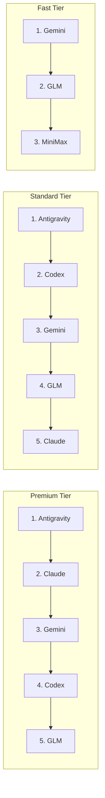

# Tier-Based Routing

## Why Tiers Exist

Not every request needs the strongest model. Running `claude-haiku` queries through the same
provider pool as `claude-opus` wastes quota and inflates costs. Tiers let the router match
request complexity to provider capability, preserve expensive quota for expensive tasks,
and fail gracefully without silent quality degradation.

## The Five Tiers

| Tier          | Purpose                                              | Quality Floor                | Max Fallback     |
| ------------- | ---------------------------------------------------- | ---------------------------- | ---------------- |
| `premium`     | Architectural work, long context, complex reasoning  | Never downgrade              | last_resort only |
| `standard`    | General coding, explanations, mid-complexity tasks   | Can upgrade, never downgrade | premium          |
| `fast`        | Short completions, syntax help, quick lookups        | standard or above            | standard         |
| `budget`      | Bulk operations, summarization, cheap parallel tasks | fast or above                | fast             |
| `last_resort` | Emergency fallback, any available provider           | None                         | -                |

The quality floor rule is critical: `premium` and `standard` requests will stall and retry
rather than silently serve a weaker model. A user who asked for Opus gets Opus or an error,
never a surprise Haiku response.

## Model → Tier Mapping

| Model pattern     | Tier     |
| ----------------- | -------- |
| `claude-opus-*`   | premium  |
| `claude-sonnet-*` | standard |
| `claude-haiku-*`  | fast     |
| `gemini-2.5-pro*` | premium  |
| `gemini-flash-*`  | budget   |
| `o3`, `o4-mini`   | standard |
| `glm-5*`          | budget   |
| `gpt-4o`          | standard |
| `gpt-4o-mini`     | fast     |



## Provider Affinity

Certain model names carry provider affinity - a preference for a specific provider before
falling back to equivalents:

- `glm-5` → try GLM first, then budget equivalents
- `gemini-flash-2.0` → try Google first, then budget equivalents
- `claude-*` → try Anthropic accounts first, then cross-provider equivalents

Affinity is a preference, not a hard constraint. If the preferred provider is unavailable,
routing continues normally through the tier's priority list.

## Content-Based Upgrade

`analyzeContentComplexity()` can upgrade a `standard` request to `premium` based on content:

**Signals that trigger upgrade:**

- Prompt contains architecture/design keywords at high density
- Security-sensitive context (auth, tokens, crypto, injection patterns)
- Prompt exceeds 4000 tokens with multi-file context
- Task type is `refactor` or `migrate` with scope > 5 files

This matters because clients often send `claude-sonnet` to save quota, but the actual task
needs Opus-level reasoning. The upgrade is logged so the user can see why a different model
was used.

## Budget-Aware Selection

Before selecting a provider, `getNextRoute()` checks account health:

1. **Quota-exhausted accounts** are skipped entirely (TTL-based, reset when quota refreshes)
2. **Approaching-quota accounts** are penalized: moved lower in priority within their tier group
3. **Healthy accounts** are round-robined in priority order

The "approaching quota" penalty prevents the common failure pattern where an account serves
requests right up to exhaustion, causing the next request to hit a hard rate limit. By
penalizing early, the router spreads load away from the account before it fails.

## Concurrency Limits

Two semaphores enforce concurrency ceilings:

```
global_semaphore = 12    # total concurrent requests across all providers
per_provider_semaphore = 4  # max concurrent to any single provider
```

Why per-provider limits matter: if 8 of 12 global slots are taken by one provider, other
providers have headroom. Without per-provider limits, a slow provider can monopolize the
global semaphore and starve faster providers of traffic.

## Failure Cascade

When a tier's provider pool is exhausted:

```
premium pool exhausted → retry with last_resort tier
standard pool exhausted → retry with premium pool (upgrade)
fast pool exhausted → retry with standard pool (upgrade)
budget pool exhausted → retry with fast pool (upgrade)
last_resort pool exhausted → return error to client
```

Upgrades on exhaustion are acceptable because serving a premium model for a budget request
is a quality improvement. The reverse is never allowed.
