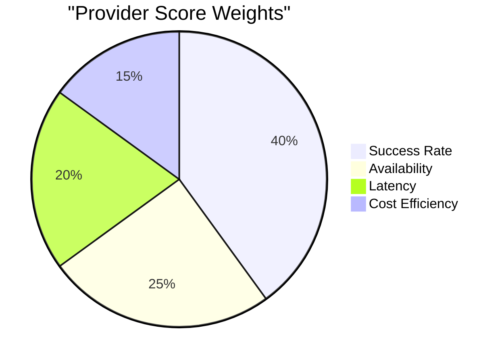
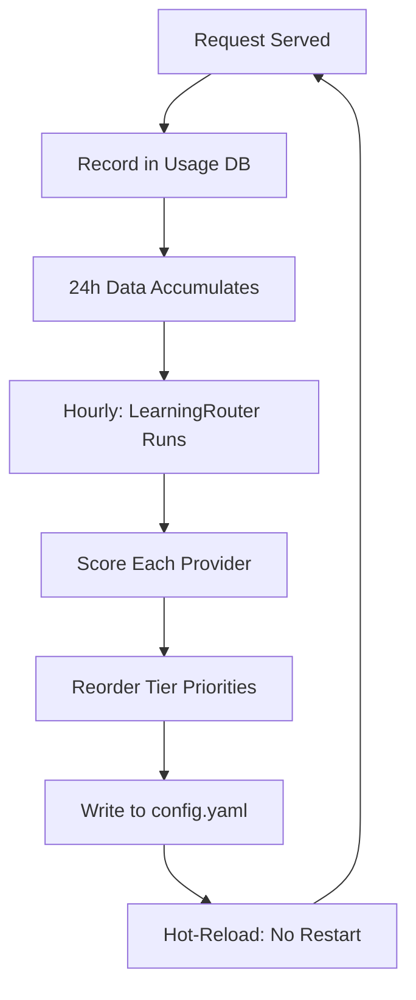

# Adaptive Learning Router

## The Problem with Static Priority

Static provider priority lists go stale. A provider that was fastest last week might be
degraded today. An account that was healthy yesterday might have hit a quota wall overnight.
Hard-coding `[anthropic-1, anthropic-2, gemini, codex]` in config means the router will
keep hammering a degraded provider instead of promoting a healthy one.

The learning router replaces intuition with measurement.

## How It Works

An hourly job reads the last 24 hours of usage data from `UsageDB` and scores every provider
on four dimensions:

| Dimension       | Weight | Measures                                                             |
| --------------- | ------ | -------------------------------------------------------------------- |
| Success rate    | 40%    | Fraction of requests that returned a valid response                  |
| Availability    | 25%    | Fraction of time the provider was not marked exhausted               |
| Latency         | 20%    | Average response time (lower is better, normalized across providers) |
| Cost efficiency | 15%    | Tokens delivered per quota unit consumed                             |

These weights reflect the priority ordering: a provider that fails is worthless regardless
of how fast it is. Availability matters more than latency because a slow answer beats no answer.



## Scoring Example

Provider A: 95% success, 2s avg latency, always available, high cost
Provider B: 85% success, 0.5s avg latency, always available, low cost

```
Score A = (0.95 * 0.40) + (1.0 * 0.25) + (normalized_latency_A * 0.20) + (cost_A * 0.15)
Score B = (0.85 * 0.40) + (1.0 * 0.25) + (normalized_latency_B * 0.20) + (cost_B * 0.15)
```

If Provider A's latency normalizes to 0.3 (slow relative to peers) and Provider B's to 0.9:

```
Score A = 0.380 + 0.250 + 0.060 + cost_A_term
Score B = 0.340 + 0.250 + 0.180 + cost_B_term
```

Provider B's latency advantage can overcome its lower success rate - but only if success
rates are close. A 10-point success gap requires a large latency and cost advantage to flip.

## Priority Reordering

After scoring, the router rewrites the tier priority lists in `config.yaml`:

```yaml
# Before learning update
tiers:
  premium:
    providers: [anthropic-account-1, anthropic-account-2, gemini-pro]

# After learning update (anthropic-account-1 degraded, gemini-pro promoted)
tiers:
  premium:
    providers: [anthropic-account-2, gemini-pro, anthropic-account-1]
```

## Hot Reload

Config changes are picked up without restarting the orchestrator. A file watcher detects
the write to `config.yaml` and reloads the tier priority maps in memory. Inflight requests
complete using the old config; new requests use the updated priorities.

This matters because the learning update runs at a fixed hour. If it writes a bad config
(edge case: all providers scored equally), the file watcher will still reload it but the
orchestrator's fallback logic ensures no request fails due to a malformed priority list.



## Anti-Oscillation

Without dampening, the router could oscillate: Provider A is promoted Monday, accumulates
traffic which causes latency to rise, gets demoted Tuesday, recovers with no traffic,
gets promoted again Wednesday - endlessly cycling.

The 24-hour rolling window prevents this. A provider that was good for 23 hours but slow
for 1 hour keeps a high score. A provider needs sustained degradation (6+ hours) before
the scoring meaningfully drops it in priority. This smooths out short incidents and
maintenance windows that don't reflect actual provider quality.

## Manual Override

Learning-driven priority is always subordinate to manual config. If you pin a provider
to position 1 via the `pinned: true` flag in config, the learning router will score it
but will not reorder it. Pinned providers stay at their position; the router reorders
only the unpinned entries around them.

Use this when you have contractual or cost reasons to prefer a specific provider regardless
of measured performance.

## What the Router Cannot Do

- It cannot detect quota exhaustion before a request fails. That is handled by the main
  routing loop's real-time account tracking.
- It cannot predict provider outages. It reacts after the 24-hour window captures failures.
- It does not tune model selection within a tier, only provider priority within a tier.
