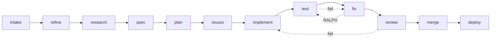

# Fleet Pipeline and RALPH Loops

## What the Pipeline Is

The fleet pipeline is a structured execution graph that takes a task description and produces
working, tested, reviewed, and deployed code. It replaces ad-hoc "ask the AI, check the output,
ask again" with a repeatable, auditable workflow that handles failure automatically.

The pipeline is not a chatbot. It is a production process.

## The 12 Stages

```
intake → refine → research → spec → plan → issues
  → implement → test → fix → review → merge → deploy
```



| Stage       | What happens                                             | Agent role      |
| ----------- | -------------------------------------------------------- | --------------- |
| `intake`    | Parse task, classify type, check for ambiguity           | Coordinator     |
| `refine`    | Clarify requirements, gather missing context             | Claude standard |
| `research`  | Scan codebase, find relevant patterns, prior art         | Gemini / fast   |
| `spec`      | Write formal specification: inputs, outputs, constraints | Claude premium  |
| `plan`      | Break spec into subtasks, extract dependency graph       | Claude premium  |
| `issues`    | Create Linear tickets from plan subtasks                 | Coordinator     |
| `implement` | Write code per spec, one subtask per agent               | Claude / Codex  |
| `test`      | Run test suite, capture failures                         | Test runner     |
| `fix`       | Address test failures, one failure set per cycle         | Claude standard |
| `review`    | Code review against spec and quality standards           | Claude premium  |
| `merge`     | Merge PR, resolve conflicts                              | Git automation  |
| `deploy`    | Run deployment pipeline, verify health                   | CI/CD           |

## Pipeline Types

Not every task needs all 12 stages. Pipeline type is inferred from task classification:

| Type       | Skipped stages                     | Use case                  |
| ---------- | ---------------------------------- | ------------------------- |
| `feature`  | None                               | New functionality         |
| `bugfix`   | `spec`, `plan`, `issues`           | Fix a known defect        |
| `refactor` | `research`, `issues`               | Restructure existing code |
| `hotfix`   | `spec`, `plan`, `issues`, `review` | Emergency production fix  |

Skipping stages is not a quality compromise - it reflects that a bugfix already has a spec
(the bug report) and a refactor already has a plan (the scope of changes).

## RALPH: Retry-Adjust-Loop-Patch-Heal

RALPH is the self-correction mechanism. When a stage fails, RALPH does not abort - it
enters a correction loop. Two loop types:

### Test-Fix Loop

Triggered when `test` stage reports failures.

```
test → fix → test → fix → test  (max 5 cycles)
```

Each `fix` cycle receives the full failure output from the previous `test`. The fix agent
is instructed to address only the failing tests, not rewrite passing code. After 5 cycles
without full green, RALPH escalates to the `review` stage with a failure annotation.

### Review-Implement Loop

Triggered when `review` stage rejects the implementation.

```
review → implement → test → fix* → review → merge → deploy
```

The `review` agent produces structured rejection feedback: which requirements were missed,
which quality standards were violated, what specific changes are required. The `implement`
agent receives this feedback as additional constraints. A new test-fix sub-loop runs before
returning to `review`.

### Cycle Tracking

`cycle_count` tracks RALPH iterations. It is managed exclusively by `_ralph_loop_reset()`.
Do not increment or reset it from stage handlers - the engine owns this counter.
RALPH stages use `stage_order = 1000 + (cycle * 100)` for ordering in the pipeline log.

## Wave Parallelism

The `plan` stage outputs a dependency graph of subtasks. The engine identifies independent
subtasks (no shared dependencies) and runs them as a wave:

```
plan output:
  task A (no deps)
  task B (no deps)
  task C (depends on A)
  task D (depends on A, B)

wave 1: [A, B]  (parallel)
wave 2: [C]     (A done)
wave 3: [D]     (A and B done)
```

Each wave spawns N concurrent `implement` agents. Wave results are collected before
starting the next wave. This collapses a 4-task sequential pipeline from 4x to ~2.5x
elapsed time when wave 1 parallelizes cleanly.

## Cost Tracking

Each stage records: model used, input tokens, output tokens, wall time (ms), cost estimate.
Aggregated per pipeline run in the `pipeline_metrics` table. Use this to identify which
stage consumes the most quota (usually `implement` on large features, `research` on unfamiliar
codebases).

## Skill Injection

The `implement` agent receives task-type-specific skill context injected into its system prompt:

- TypeScript task → TypeScript style guide, test conventions
- Python task → ruff config, pytest patterns
- API task → OpenAPI spec template, auth patterns

Skills are loaded from `~/.agent-gateway/skills/` and selected by matching task type keywords.
This avoids loading all skills into every agent (token waste) while ensuring relevant
conventions are always present.

## Symphony Integration

Linear issues created in the `issues` stage are monitored by Symphony poller. When a
Linear issue transitions to `In Progress`, Symphony can trigger a new pipeline run for
that specific issue. This closes the loop: pipeline creates issues, issues trigger pipelines.
