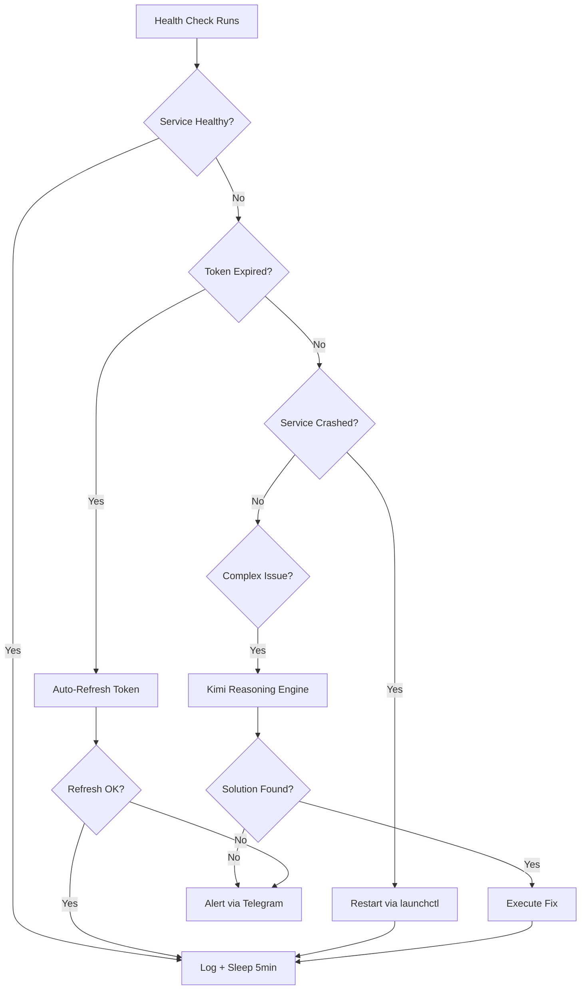

# Self-Healing with Nanoclaw

## The Problem

AI infrastructure has three categories of routine failure:

1. **Token expiry**: OAuth tokens for Claude, Codex, Gemini, Antigravity, and Kimi expire
   on independent schedules. A single expired token silently breaks all routes to that provider.

2. **Service crashes**: Orchestrator, CLIProxyAPI, Fleet Gateway - any can crash, go OOM,
   or get stuck. macOS LaunchAgent KeepAlive handles restarts, but not the state cleanup
   needed after a crash.

3. **Account degradation**: Rate limits, quota exhaustion, auth failures accumulate over time.
   Without remediation, a degraded account stays degraded even after the underlying issue clears.

Manual remediation means: notice the failure (often after 10+ minutes), SSH to the machine,
diagnose, fix, restart. Nanoclaw targets a 2-minute automated resolution for known failure modes.



## Architecture

```
LaunchAgent (KeepAlive)
    |
    v
nanoclaw daemon (Python, 5-min health check cycle)
    |
    |-- HealthChecker     → polls all service endpoints
    |-- TokenRefresher    → refreshes 5-provider OAuth before expiry
    |-- ReasoningEngine   → Kimi LLM for non-trivial failures
    |-- Notifier          → Telegram alert on escalation
    |
    v
State: ~/.nanoclaw/state.json  (incidents, healing actions, token expiry timestamps)
```

## Health Check Cycle (5 minutes)

Every 5 minutes, Nanoclaw polls:

| Service               | Endpoint                 | Expected          |
| --------------------- | ------------------------ | ----------------- |
| CLIProxyAPI           | `localhost:8317/health`  | `{"status":"ok"}` |
| Orchestrator          | `localhost:8318/health`  | `{"status":"ok"}` |
| Fleet Gateway         | `localhost:4105/health`  | `{"status":"ok"}` |
| Agent Gateway Gateway | `localhost:18789/health` | HTTP 200          |
| Personal Agent        | `localhost:18790/health` | HTTP 200          |

A service that fails 2 consecutive checks (10 minutes) enters the healing flow.
A single failed check is logged but not acted on - transient blips are common.

## Token Refresh

OAuth tokens are refreshed proactively, before they expire, not reactively after they fail.
Nanoclaw reads each provider's token file, checks the `expires_at` timestamp, and refreshes
tokens with more than 30 minutes but less than 2 hours of remaining validity.

| Provider           | Token location                      | Refresh method                                |
| ------------------ | ----------------------------------- | --------------------------------------------- |
| Claude (Anthropic) | `~/.claude/credentials`             | PKCE → `console.anthropic.com/v1/oauth/token` |
| Codex              | `~/.codex/auth.json`                | OAuth2 refresh grant                          |
| Gemini             | `~/.config/gemini/credentials.json` | Google OAuth2                                 |
| Antigravity        | `~/.antigravity/token.json`         | Provider-specific                             |
| Kimi               | `~/.kimi/session.json`              | Session refresh                               |

Token files use snake_case fields: `access_token`, `refresh_token`, `expires_at` (ISO8601),
`type`. After refresh, Nanoclaw writes the new token and triggers a config reload in
the services that consume it (CLIProxyAPI, Orchestrator).

## Reasoning Engine

When a simple restart does not fix a failing service, Nanoclaw escalates to reasoning.
It feeds a structured failure summary to the Kimi LLM:

```
Context:
  - Service: orchestrator
  - Failure: 3 consecutive health check failures
  - Last known good: 2h ago
  - Recent logs (last 100 lines): [...]
  - Recent healing actions: [restart at T-45m, restart at T-12m]

Question: What is the most likely root cause and what action should be taken?
```

Kimi returns a structured response: `root_cause`, `confidence`, `action`, `rollback_if_fail`.

Nanoclaw executes the suggested action, waits for 2 health check cycles, and evaluates
whether the service recovered. If it did not, the reasoning output and result are logged
and the incident escalates to human notification.

## Escalation

If reasoning-driven healing fails, Nanoclaw sends a Telegram message to the owner:

```
[NANOCLAW] Orchestrator :8318 unresolved after 3 healing attempts.
Last action: rotate_log_and_restart (Kimi confidence: 72%)
Still failing after 10 minutes.
Logs: ~/.nanoclaw/incidents/2026-03-17T14:23:00-orchestrator.log
```

The message includes the incident log path, last action taken, and Kimi's confidence score.
This gives the human enough context to act immediately without SSHing blind.

## State File

`~/.nanoclaw/state.json` tracks:

```json
{
  "incidents": [
    {
      "service": "orchestrator",
      "started_at": "2026-03-17T14:13:00Z",
      "resolved_at": "2026-03-17T14:18:00Z",
      "actions": ["restart", "rotate_log_and_restart"],
      "resolved": true
    }
  ],
  "token_refresh_log": [
    {
      "provider": "claude",
      "refreshed_at": "2026-03-17T12:00:00Z",
      "next_check": "2026-03-17T13:30:00Z"
    }
  ]
}
```

State is append-only for incidents. Token refresh entries are updated in place.

## Deployment

Nanoclaw runs as a macOS LaunchAgent with `KeepAlive: true`. If the daemon crashes, launchd
restarts it. The daemon itself never calls `launchctl` - it delegates all service restarts
to `launchctl kickstart` commands, which are idempotent and safe to run on already-running services.

`ThrottleInterval: 30` in the LaunchAgent plist prevents restart cascades if Nanoclaw itself
is crash-looping (e.g., due to a bad Kimi response parsing edge case).
