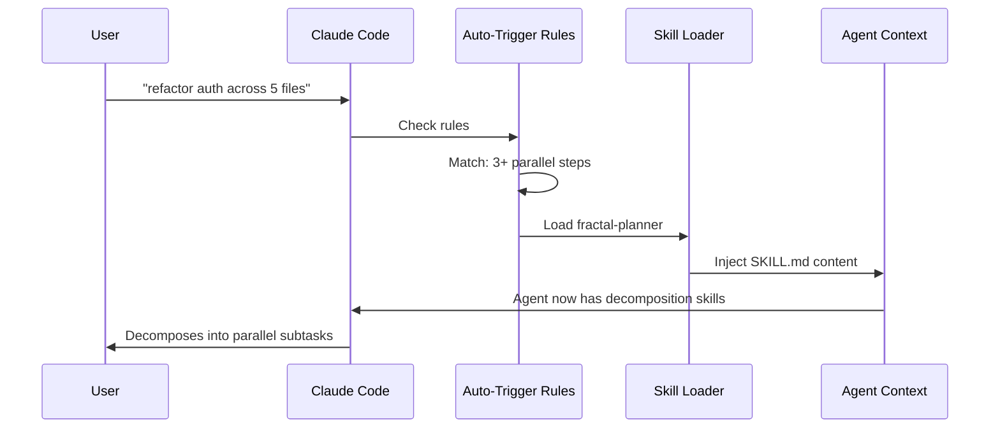

# The Skill System

## What a Skill Is

Skills are markdown files that inject pre-authored behavior into AI agents. They are not code. They are structured prompt engineering templates that teach an agent a specific workflow - how to think, what steps to follow, what to avoid.

A skill directory looks like this:

```
skills/fractal-planner/
  SKILL.md       # the prompt - defines trigger, workflow, examples, anti-patterns
  skill.json     # optional metadata: name, description, trigger keywords
```

When you invoke `/fractal-planner`, the agent loads `SKILL.md` into its context and follows the workflow defined there.

## Why This Architecture

Without skills, every agent session starts from scratch. The agent knows general programming but has no institutional memory of your workflows, your constraints, or your preferred patterns.

Skills encode that knowledge once. They are version-controlled, auditable, and composable. You update a skill in the repo, run `install.sh`, and every agent using that skill picks up the new behavior.

## Loading Mechanism

Skills live in `~/.claude/skills/` as symlinks to the repo source. They are loaded on-demand:

- Explicit invocation: `/fractal-planner` in a prompt
- Auto-trigger rules: rules in `~/.claude/rules/` watch for intent signals and call skills automatically
- Skill-to-skill: a parent skill can load sub-skills during execution

The auto-trigger pattern means you rarely need to invoke skills manually. The rules layer reads your intent and routes to the right skill.



## Authoring a Skill

Structure every `SKILL.md` with these sections:

**1. Trigger** - When should this skill be used? What user intent does it match?

```
Use this skill when the task involves 3+ parallelizable steps across files or systems.
```

**2. Workflow** - Numbered steps the agent must follow. Be prescriptive.

```
1. Decompose the objective into atomic sub-tasks
2. Classify each sub-task by complexity
3. Assign agents based on complexity tier
4. Dispatch in parallel, max 4-5 concurrent
5. Collect results and synthesize
```

**3. Examples** - Concrete input/output pairs. Agents generalize from examples better than abstract rules.

**4. Anti-patterns** - What the agent must NOT do. Constraints are as important as instructions.

```
Do NOT combine unrelated sub-tasks in a single agent call.
Do NOT spawn more than 5 concurrent agents (rate limit risk).
```

**5. Output format** - How results should be structured and reported.

Keep skills under 500 lines. Every line costs context budget. If a skill is growing past 300 lines, it is probably doing too much - split it.

## Skills in This Repo

| Skill              | Purpose                                                        |
| ------------------ | -------------------------------------------------------------- |
| `fractal-planner`  | Decompose large tasks, dispatch parallel agents                |
| `pipeline`         | End-to-end feature engineering: spec → code → test → PR        |
| `fleet/swarm`      | Multi-agent coordination with quality gates                    |
| `tdd-agent`        | Test-driven development: write tests first, implement to green |
| `experiment-loop`  | Fan-out search across multiple approaches, pick best           |
| `verify-impl`      | End-to-end verification before declaring completion            |
| `budget-check`     | Estimate token/cost before running expensive pipelines         |
| `worktree-manager` | Git worktree isolation for parallel agent branches             |

## Creating Your Own Skill

1. Copy any existing skill directory as a starting template
2. Rewrite the trigger, workflow, examples, and anti-patterns
3. Add to `skills/` in this repo
4. Run `./install.sh` to symlink into `~/.claude/skills/`
5. Optionally add an auto-trigger rule in `rules/` so the skill fires on intent detection

The fastest way to learn skill authoring is to read `skills/fractal-planner/SKILL.md` and `skills/verify-impl/SKILL.md` back to back. They represent the two ends of the spectrum: decomposition (fractal) and verification (verify-impl).
