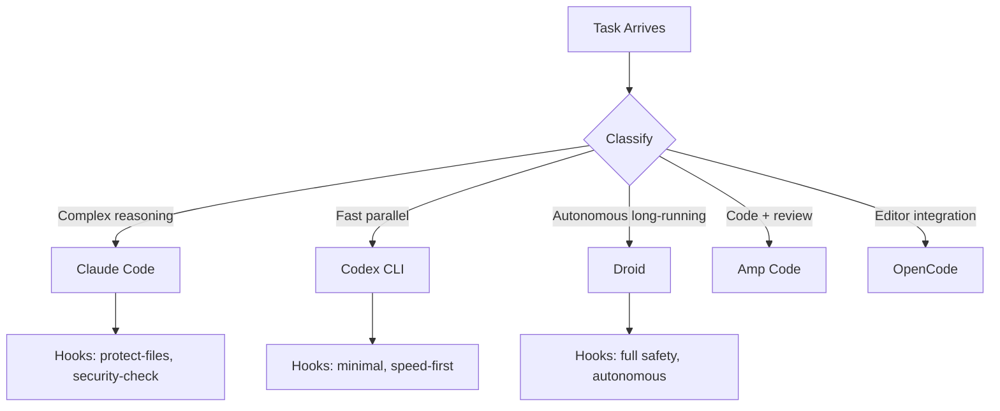

# Multi-Agent Configuration

## The Five Agents

This system configures five coding agents, each with different strengths:

| Agent       | Binary     | Strength                           | Best for                                         |
| ----------- | ---------- | ---------------------------------- | ------------------------------------------------ |
| Claude Code | `claude`   | Deep reasoning, complex refactors  | Architecture decisions, security, ambiguous bugs |
| Codex CLI   | `codex`    | Fast, parallel, good at repetition | Boilerplate, docstrings, mechanical transforms   |
| Droid       | `droid`    | Autonomous long-horizon tasks      | Unattended overnight runs                        |
| Amp Code    | `amp`      | Quality-focused, careful           | Code review, high-stakes changes                 |
| OpenCode    | `opencode` | Flexible, open-source              | Experimentation, cost-sensitive tasks            |

All five agents share the same rules and hooks from this repo. Their behavior is consistent because configuration is centralized here - not scattered across per-agent dotfiles.

## Configuration Structure

Each agent gets four layers of configuration:

```
agents/<agent-name>/
  settings.json   # model selection, MCP servers, permissions
  hooks/          # PreToolUse and PostToolUse scripts
  rules/          # behavioral constraints (symlinked from /rules)
  mcp-servers/    # tool integrations (symlinked from /mcp)
```

`install.sh` deploys these into the agent's expected config directory (e.g., `~/.claude/` for Claude Code, `~/.codex/` for Codex).

## Hooks: The Safety Layer

Hooks intercept tool calls before and after execution. They are the enforcement mechanism - they cannot be overridden by the agent's reasoning.

**PreToolUse hooks** run before any tool executes:

- File protection: block writes to `.env`, `package-lock.json`, `*.pem`, and other sensitive files
- MCP guards: block external integrations outside allowed repos, block Crypto.com tools project-wide
- Security checks: flag requests that look like credential exfiltration or destructive operations

**PostToolUse hooks** run after tool execution:

- Context budget governance: warn at 60% context, hard-stop at 85%
- Audit logging: record tool calls to `~/.ai-fleet/logs/`

Hooks are shell scripts. They exit 0 to allow, exit 1 to block. The blocking message is shown to the agent so it can understand why it was stopped.

## Rules: Behavioral Shaping

Rules are markdown files in `~/.claude/rules/` that are always loaded into context. They constrain behavior without code:

| Rule file                   | What it enforces                                           |
| --------------------------- | ---------------------------------------------------------- |
| `discipline.md`             | Scope lock - don't expand beyond the stated task           |
| `coding-style.md`           | Kolmogorov complexity, no unnecessary comments             |
| `workflow-orchestration.md` | Plan before implementing, use subagents cleanly            |
| `security.md`               | No credential commits, no force pushes, messaging lockdown |

Rules work because they are always present in context. The agent reads them at session start. Unlike hooks, rules rely on the model following instructions - they are not hard enforcement. Use hooks for hard limits, rules for soft behavioral shaping.

## Routing: Why Multiple Agents

A single agent handling all tasks is inefficient and expensive. The coordinator classifies incoming tasks by:

1. **Complexity** - simple transformation vs. architectural reasoning
2. **Parallelizability** - independent sub-tasks vs. sequential dependencies
3. **Risk level** - high-stakes (security, payments) vs. low-stakes (formatting)

Examples:

```
"Fix the authentication race condition"
→ Complexity: high | Risk: high | Sequential
→ Route: Claude Code (complex reasoning, careful)

"Add docstrings to all 47 service files"
→ Complexity: low | Parallelizable: yes
→ Route: Codex CLI x5 (parallel workers, each takes a batch)

"Run overnight refactor and open PRs"
→ Long-horizon, unattended
→ Route: Droid (designed for autonomous runs)
```



## Deploying Configuration Changes

The repo is the source of truth. Never edit agent config directories directly - changes there get overwritten on the next `install.sh` run.

Workflow:

1. Edit in `agents/<agent>/` or `rules/` or `hooks/`
2. `./install.sh` - deploys symlinks and copies to agent config dirs
3. Restart any running agent sessions to pick up changes

Rule changes take effect immediately in new sessions. Hook changes take effect immediately (hooks are read from disk on each tool call, not cached).
