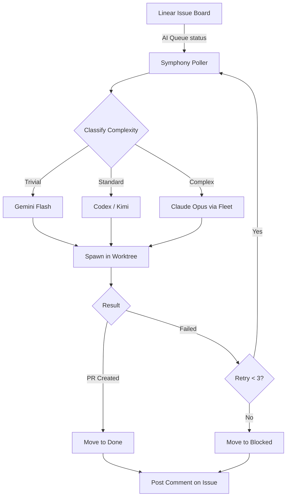

# Symphony: Issue Tracker to Agent Dispatch

## The Problem

You have a Linear board full of issues. You have a fleet of AI agents. Connecting them manually - reading issues, spinning up agents, tracking completion, posting results - is toilwork. Symphony automates the entire loop.

## What Symphony Does

Symphony is a polling daemon. Every 2 minutes it:

1. Fetches open issues from Linear (configurable: status, labels, assignee)
2. Classifies each issue by complexity
3. Dispatches the right agent via tmux/worktree
4. Tracks state in SQLite
5. Detects completion or timeout
6. Posts results back to the issue

## Complexity Classification

Every issue gets classified before dispatch. Classification is based on title, description, and labels:

| Tier     | Signal                         | Model                 | Typical latency |
| -------- | ------------------------------ | --------------------- | --------------- |
| Trivial  | Typo, config change, copy edit | Gemini Flash          | 1-3 min         |
| Standard | Feature, refactor, test        | Codex or Kimi         | 5-15 min        |
| Complex  | Architecture, security, auth   | Claude Opus via fleet | 20-60 min       |

Classification errors are recoverable - a trivial task dispatched to a premium model wastes money but still completes. A complex task dispatched to a budget model fails and gets retried at a higher tier.

## REPO_MAP

Symphony needs to know where each project lives on disk. `REPO_MAP` in the config maps issue labels (or Linear project IDs) to local filesystem paths:

```yaml
repo_map:
  backend: ~/Dev/myapp/api
  frontend: ~/Dev/myapp/web
  infra: ~/Dev/myapp/infra
```

When an issue has label `backend`, Symphony dispatches the agent with working directory set to `~/Dev/myapp/api`. Without a matching REPO_MAP entry, the issue is skipped.

## State Machine

Each issue moves through states tracked in `~/.ai-fleet/symphony/state.db`:

```
pending → dispatched → running → completed
                              → failed (retry eligible)
                              → timeout (60 min default)
```

Transitions:

- `pending → dispatched`: agent process spawned, PID recorded
- `dispatched → running`: agent confirms task receipt (heartbeat)
- `running → completed`: agent posts completion signal, diff recorded
- `running → failed`: agent exits non-zero, retry counter incremented
- `running → timeout`: no heartbeat for 60 minutes, process killed

## Retry Logic

Max 3 attempts per issue. On failure:

- Attempt 1: same model, same tier
- Attempt 2: upgrade one tier (standard → complex)
- Attempt 3: complex tier, with additional context from failure logs

After 3 failures, issue moves to Backlog with a comment explaining what was attempted.

## Why Polling, Not Webhooks

Webhooks require a public endpoint. That means a domain, TLS cert, firewall rules, and uptime monitoring for the webhook receiver itself.

Polling requires nothing. The daemon runs on your production server behind NAT, phones home to Linear, and everything works. Two-minute polling lag is acceptable for async development work. For time-critical tasks, manual dispatch via `symphony-ctl` is available.

## Control Interface

`symphony-ctl` is a CLI for managing the dispatch queue:

```bash
symphony-ctl status              # queue depth, running agents, recent completions
symphony-ctl queue               # list all pending/running issues
symphony-ctl move <id> <status>  # manually transition an issue
symphony-ctl retry <id>          # force retry a failed issue
symphony-ctl logs <id>           # tail agent output for an issue
symphony-ctl health              # check poller + dispatcher health
```

State DB location: `~/.agent-gateway/symphony-state.db` (set via `STATE_DB` env var).

## Integration Points

Symphony sits between Linear and your agent fleet. It does not replace either:

- Linear remains your source of truth for task management
- Agents remain your execution layer
- Symphony is the glue: classification, routing, state tracking, result reporting



You can run Symphony alongside manual coding sessions. It operates on issues in specific statuses (e.g., "Ready") and does not touch issues in "In Progress" or "Review" unless explicitly configured to.
