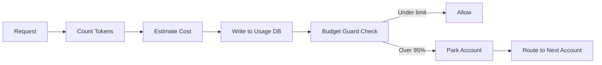
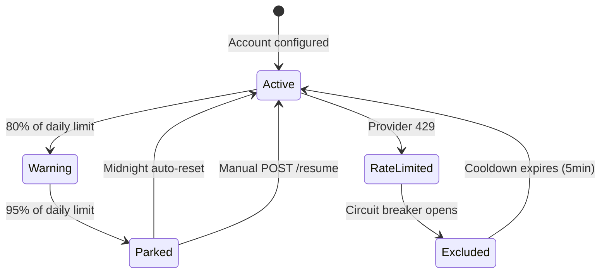

# Budget Enforcement

## The Problem

A fleet of agents running in parallel against premium models can burn through API credits faster than any human oversight can catch. A single runaway pipeline - infinite retry loop, misconfigured fan-out, accidentally dispatched to Opus instead of Flash - can exhaust a daily budget in under an hour.

Budget enforcement is not optional. It must be automatic, per-provider, and impossible to accidentally disable.

## Budget Guard

Budget Guard is the accounting layer inside CLIProxyAPI. Every request is tracked:

```
provider: anthropic
account: account-01@example.com
model: claude-opus-4-5
input_tokens: 12400
output_tokens: 847
cost_estimate_usd: 0.19
timestamp: 2026-03-17T14:22:01Z
```



Per-provider daily limits are set in `config.yaml`:

```yaml
providers:
  anthropic:
    daily_token_limit: 5_000_000
    daily_cost_limit_usd: 50.00
  openai:
    daily_token_limit: 10_000_000
    daily_cost_limit_usd: 30.00
```

## Account Parking

When an account reaches 95% of its daily limit, it is **parked**:

- The account is removed from the active routing pool
- Subsequent requests route to other accounts in the same provider
- If all accounts for a provider are parked, requests fail with `BUDGET_EXHAUSTED`
- Parked accounts auto-resume at midnight (local time, configurable)

The 95% threshold gives a 5% buffer for in-flight requests that were dispatched just before the limit was hit.

Manual resume (e.g., after adding credits): `POST /v0/management/budget/resume`



## Fleet vs Interactive Request Priority

Not all requests are equal. The system distinguishes:

| Mode        | Retry attempts | Timeout | Why                                                      |
| ----------- | -------------- | ------- | -------------------------------------------------------- |
| Interactive | 5              | 30s     | User is waiting - latency matters more than thoroughness |
| Fleet/async | 8              | 120s    | Background task - maximize completion rate               |

Fleet tasks tolerate more retries because the user is not blocked. Interactive requests fail fast to preserve session quality.

## Quality Floor

Budget pressure must never degrade quality on high-stakes requests. The quality floor rule:

- Requests tagged `quality: premium` (security audits, payment logic, architecture) never route to budget-tier models
- This holds even when premium accounts are near their daily limit
- The system will queue premium requests or fail them, but will not silently downgrade the model

This is enforced in the routing layer, not as a suggestion. A `quality: premium` request with no eligible accounts returns a hard error, not a degraded response.

## LearningRouter Cost Integration

The LearningRouter scores providers across five dimensions. Cost efficiency is 15% of the total score:

```
provider_score = (
  success_rate    * 0.35 +
  latency_score   * 0.25 +
  quality_score   * 0.15 +
  cost_efficiency * 0.15 +
  availability    * 0.10
)
```

Expensive providers get a lower cost_efficiency score, which deprioritizes them in routing unless they outperform on other dimensions. This is a soft pressure - it does not replace hard budget limits but reduces drift toward expensive defaults over time.

## Management API

| Endpoint                       | Method | What it returns                                     |
| ------------------------------ | ------ | --------------------------------------------------- |
| `/v0/management/budget`        | GET    | Current daily usage and limits per provider/account |
| `/v0/management/usage`         | GET    | Token usage broken down by hour for today           |
| `/v0/management/budget/resume` | POST   | Unpark all accounts (manual override)               |
| `/v0/management/budget/park`   | POST   | Manually park an account before it hits the limit   |

The budget endpoint is the first thing to check when requests start failing unexpectedly:

```bash
curl http://localhost:8317/v0/management/budget | jq '.providers'
```

If every account for a provider shows `parked: true`, the daily limit was hit. Wait for midnight reset or add a new account to the provider pool.
