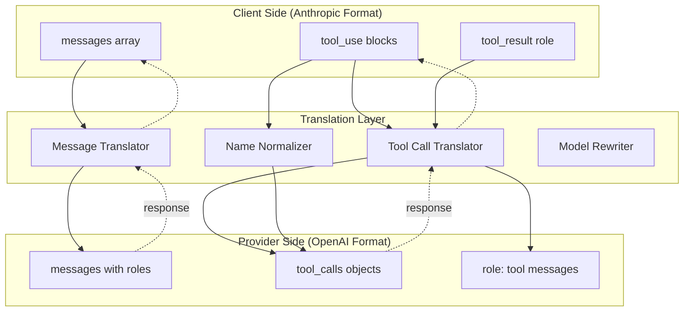

# Cross-Provider Translation

## The Problem

Claude Code is built against the Anthropic API. Codex is built against the OpenAI API. Gemini speaks a different dialect of the same OpenAI-compatible format. If you want to route a Claude Code request to Gemini or Codex under the hood, you need translation - and that translation must be completely transparent to the client.

The goal: Claude Code thinks it is always talking to Claude. It does not change behavior based on which provider actually served the request.

## Translation Layers

There are seven distinct translation problems:

### 1. Message Format

Anthropic uses a `messages` array with a separate `system` parameter. OpenAI embeds system as a message with `role: "system"`.

```
Anthropic: { system: "...", messages: [{role: "user", content: "..."}] }
OpenAI:    { messages: [{role: "system", content: "..."}, {role: "user", content: "..."}] }
```

### 2. Tool Calls (Request Direction)

Anthropic tool use is a content block inside a message. OpenAI tool calls are a top-level field on the message object.

```
Anthropic: { role: "assistant", content: [{ type: "tool_use", id: "...", name: "...", input: {...} }] }
OpenAI:    { role: "assistant", tool_calls: [{ id: "...", function: { name: "...", arguments: "..." } }] }
```

Note: Anthropic `input` is a JSON object. OpenAI `arguments` is a JSON string. The translation must serialize/deserialize at the boundary.

### 3. Tool Results (Response Direction)

Anthropic tool results are user messages with a `tool_result` content block. OpenAI tool results are messages with `role: "tool"`.

```
Anthropic: { role: "user", content: [{ type: "tool_result", tool_use_id: "...", content: "..." }] }
OpenAI:    { role: "tool", tool_call_id: "...", content: "..." }
```

### 4. Tool Name Normalization

LLMs hallucinate tool names. Common mutations:

- Hyphen/underscore swap: `read_file` vs `read-file`
- Truncation: Gemini enforces a 64-character limit on tool names
- Capitalization drift: `ReadFile` vs `read_file`

The translator fuzzy-matches incoming tool names against the registered tool list using Levenshtein distance. If distance < 3 and it is unambiguous, the name is silently corrected. If ambiguous, the request fails with a clear error.

Gemini-specific: tool names are truncated to 64 chars on outbound. On inbound, the translator expands them back using the original names from the session's tool registry.

### 5. Model Name Rewriting

The client requests `claude-opus-4-5`. The orchestrator routes to Gemini. The response comes back with `model: "gemini-2.5-pro"`. The translator rewrites the response `model` field to `claude-opus-4-5` before returning to the client.

This is not deception - it is API contract fulfillment. The client is getting the capability it requested, just served by a different backend.

### 6. Thinking Blocks

Anthropic extended thinking produces `thinking` content blocks in the response. Codex uses `reasoning_content` as a separate response field. Most providers produce neither.

Rules:

- If the client did not enable `thinking`, strip all thinking blocks from responses regardless of provider
- If the client enabled `thinking` and the provider does not support it, return an empty thinking block (preserves contract, does not fail)
- Never forward `reasoning_content` from Codex unless the client explicitly requested thinking

### 7. Streaming

All providers nominally support SSE streaming, but with differences:

- Anthropic sends `content_block_delta` events with fine-grained deltas
- OpenAI sends `choices[0].delta` events
- Some providers buffer entire responses and fake streaming by chunking

The translator normalizes all streams to the Anthropic SSE format. For non-streaming providers, the orchestrator buffers the response and emits a synthetic stream with a configurable chunk size (default: 50 chars). Keepalive pings (empty SSE comments) are sent every 15 seconds to prevent client timeout during long reasoning delays.



## Edge Cases

| Case                                        | Handling                                                                     |
| ------------------------------------------- | ---------------------------------------------------------------------------- |
| Gemini tool name > 64 chars                 | Truncate outbound, expand inbound via session registry                       |
| Provider does not support streaming         | Buffer + synthetic chunked stream                                            |
| Provider does not support extended thinking | Return empty `thinking` block                                                |
| Image/PDF content blocks                    | Pass through to multimodal providers; strip and warn for text-only providers |
| `max_tokens` differences                    | Cap to provider maximum; log if client's value was reduced                   |
| Stop sequences                              | Pass through; some providers ignore them - log when stop reason differs      |

## Why This Is Hard

The translation is stateful. Tool names registered in a session must be remembered to expand Gemini's truncated names. Thinking block handling depends on what the client requested, not just what the provider returned. Model rewriting must happen on every response, including streaming chunks that contain the model field.

The translator maintains a per-request context object through the entire request lifecycle - from inbound normalization through provider dispatch through response translation. This context is not persisted across requests (each request is independent) but must survive for the full duration of a streaming response, which can span minutes.
