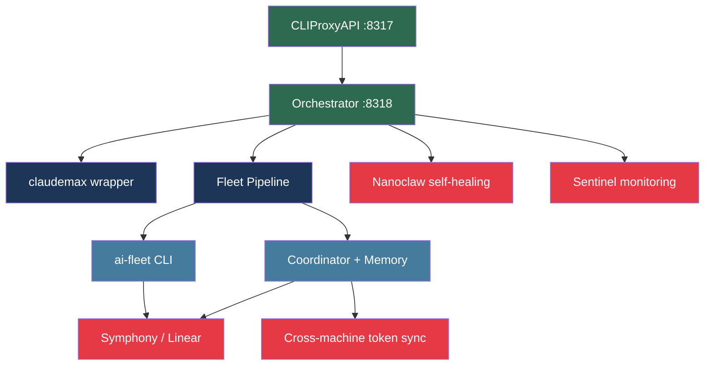

# Modular Installation Guide

Not every team needs the full autonomous stack. This guide defines four additive tiers - each tier is a superset of the one before it. Pick your stopping point.

---

## Dependency Map



| Tier | Label                   | Time     | Stops at                       |
| ---- | ----------------------- | -------- | ------------------------------ |
| 1    | Solo Developer          | ~30 min  | Orchestrator                   |
| 2    | Power User              | ~1 hour  | claudemax + skills             |
| 3    | Team Lead               | ~2 hours | Fleet + coordinator            |
| 4    | Full Autonomous Station | ~4 hours | Symphony + self-healing + sync |

---

## Tier 1: Solo Developer (~30 min)

**What you get**: Multi-provider failover for your coding sessions. If Anthropic is slow or rate-limited, requests automatically route to the next healthy provider.

**Components**: CLIProxyAPI + Orchestrator

### Install

```bash
# 1. Clone fullstackOS
git clone https://github.com/yourorg/fullstackOS ~/.fullstackOS
cd ~/.fullstackOS

# 2. Install CLIProxyAPI
cd services/cliproxyapi
npm install
cp config.example.yaml config.yaml
```

Edit `config.yaml` - add 2-3 providers:

```yaml
providers:
  - name: anthropic
    base_url: https://api.anthropic.com
    api_key: ${ANTHROPIC_API_KEY}
    models: ["claude-sonnet-4-5", "claude-opus-4-5"]
    weight: 10

  - name: openrouter
    base_url: https://openrouter.ai/api/v1
    api_key: ${OPENROUTER_API_KEY}
    models: ["anthropic/claude-sonnet-4-5"]
    weight: 5

port: 8317
auth_key: your-proxy-key
```

```bash
# 3. Start CLIProxyAPI
node server.js &

# 4. Install Orchestrator
cd ../../services/orchestrator
npm install
cp config.example.yaml config.yaml
# Edit config.yaml: set upstream to http://localhost:8317
node server.js &

# 5. Point Claude Code at the orchestrator
export ANTHROPIC_BASE_URL=http://localhost:8318
claude  # verify it connects
```

### Verify

```bash
curl http://localhost:8317/health   # {"status":"ok","providers":3}
curl http://localhost:8318/health   # {"status":"ok","accounts":1}
```

**Result**: `claude` now routes through the proxy. Provider failures are transparent.

---

## Tier 2: Power User (~1 hour)

**What you get**: Resilient sessions with isolated auth, skill-augmented agents, and protected file hooks.

**Adds**: claudemax wrapper + 9 skills + hooks

### Install

```bash
# 1. Install claudemax wrapper
cp scripts/claudemax /usr/local/bin/claudemax
chmod +x /usr/local/bin/claudemax

# 2. Create isolated auth directory
mkdir -p ~/.claude-proxy

# 3. Deploy core skills
mkdir -p ~/.claude/skills
cp -r skills/fleet ~/.claude/skills/
cp -r skills/fleetmax ~/.claude/skills/
cp -r skills/fractal-planner ~/.claude/skills/
cp -r skills/bug-hunter ~/.claude/skills/
cp -r skills/tdd-agent ~/.claude/skills/
cp -r skills/verify-impl ~/.claude/skills/
cp -r skills/budget-check ~/.claude/skills/
cp -r skills/workflow ~/.claude/skills/
cp -r skills/coding-style ~/.claude/skills/

# 4. Deploy hooks
mkdir -p ~/.claude/hooks
cp hooks/protect-files.sh ~/.claude/hooks/
cp hooks/bash-security.sh ~/.claude/hooks/
cp hooks/context-budget-governor.sh ~/.claude/hooks/
chmod +x ~/.claude/hooks/*.sh
```

Register hooks in `~/.claude/settings.json`:

```json
{
  "hooks": {
    "PreToolUse": [
      {
        "matcher": "Write|Edit",
        "hooks": [
          { "type": "command", "command": "~/.claude/hooks/protect-files.sh" }
        ]
      },
      {
        "matcher": "Bash",
        "hooks": [
          { "type": "command", "command": "~/.claude/hooks/bash-security.sh" }
        ]
      }
    ]
  }
}
```

### Deploy rules

```bash
cp rules/discipline.md ~/.claude/rules/
cp rules/coding-style.md ~/.claude/rules/
cp rules/workflow-orchestration.md ~/.claude/rules/
cp rules/fractal-planner.md ~/.claude/rules/
cp rules/bug-hunter.md ~/.claude/rules/
```

### Use

```bash
claudemax          # instead of `claude` - uses isolated auth + auto-recovery
claudemax doctor   # verify connectivity
```

**Result**: Sessions survive proxy restarts. Skills auto-trigger on context cues. Protected files cannot be overwritten by agents.

---

## Tier 3: Team Lead (~2 hours)

**What you get**: Dispatch work to AI agents, track costs, auto-correct test and review failures.

**Adds**: Fleet pipeline + ai-fleet CLI + coordinator + LaunchAgents

### Install fleet engine

```bash
cd fleet
pip install -e .

# Verify
python3 -m pytest ../tests/ -q --tb=short
# Expected: ~1244 tests pass
```

### Install CLI tools

```bash
cp bin/ai-fleet /usr/local/bin/ai-fleet
cp bin/ai-coordinator /usr/local/bin/ai-coordinator
chmod +x /usr/local/bin/ai-fleet /usr/local/bin/ai-coordinator

# Initialize coordinator memory
ai-coordinator init
```

### Configure coordinator

```bash
mkdir -p ~/.ai-fleet/coordinator
cp config/coordinator.example.yaml ~/.ai-fleet/coordinator/config.yaml
```

Edit `~/.ai-fleet/coordinator/config.yaml`:

```yaml
memory_db: ~/.ai-fleet/coordinator/memory.db
fleet_gateway: http://localhost:4105
auth_key: sk-ai-fleet-local
max_parallel_agents: 5
cost_ceiling_usd: 10.0
```

### Install LaunchAgents (macOS)

```bash
# Install always-on services
cp launchd/ai.cliproxyapi.plist ~/Library/LaunchAgents/
cp launchd/ai.orchestrator.plist ~/Library/LaunchAgents/

launchctl load ~/Library/LaunchAgents/ai.cliproxyapi.plist
launchctl load ~/Library/LaunchAgents/ai.orchestrator.plist

# Install fleet gateway
cd services/fleet-gateway
npm install
cp launchd/ai.fleet.gateway.plist ~/Library/LaunchAgents/
launchctl load ~/Library/LaunchAgents/ai.fleet.gateway.plist
```

### Verify

```bash
curl http://localhost:4105/health
ai-fleet status
ai-coordinator health
```

### Use

```bash
# Dispatch work
ai-fleet team "Refactor auth module across all services"

# Monitor
ai-fleet status
ai-coordinator monitor
```

**Result**: Multi-agent parallel work. RALPH self-correction loop retries on failure. Cost tracked per run.

---

## Tier 4: Full Autonomous Station (~4 hours)

**What you get**: Linear issues auto-dispatched to AI agents, infrastructure self-heals on failure, tokens synced across machines.

**Adds**: Symphony + Nanoclaw + Sentinel + cross-machine token sync

### Symphony (Linear → AI dispatch)

```bash
# Prerequisites: Linear API key, Linear team ID
cd services/symphony

pip install -r requirements.txt

cp config.example.yaml config.yaml
```

Edit `config.yaml`:

```yaml
linear:
  api_key: ${LINEAR_API_KEY}
  team_id: ${LINEAR_TEAM_ID}
  trigger_labels: ["ai-dispatch", "autofix"]
  poll_interval_seconds: 60

fleet_gateway: http://localhost:4105
state_db: ~/.agent-gateway/symphony-state.db
max_retries: 3
```

```bash
# Install CLI
cp bin/symphony-ctl ~/.local/bin/symphony-ctl
chmod +x ~/.local/bin/symphony-ctl

# Load LaunchAgent
cp launchd/ai.symphony.plist ~/Library/LaunchAgents/
launchctl load ~/Library/LaunchAgents/ai.symphony.plist

# Verify
symphony-ctl health
symphony-ctl status
```

### Nanoclaw (self-healing daemon)

```bash
cd services/nanoclaw
pip install -r requirements.txt

cp config.example.yaml config.yaml
# Edit: set provider = kimi, set alert thresholds
```

```bash
cp launchd/ai.nanoclaw.plist ~/Library/LaunchAgents/
launchctl load ~/Library/LaunchAgents/ai.nanoclaw.plist
```

Nanoclaw watches: CLIProxyAPI, Orchestrator, Fleet Gateway, Symphony, token expiry, disk space, memory pressure.

### Sentinel (monitoring)

```bash
cd services/sentinel
npm install

cp launchd/ai.sentinel.plist ~/Library/LaunchAgents/
launchctl load ~/Library/LaunchAgents/ai.sentinel.plist

# Verify alert routing
curl http://localhost:8319/health
```

### Cross-machine token sync

```bash
# Configure target machines in sync config
cp scripts/sync-tokens.example.sh scripts/sync-tokens.sh
chmod +x scripts/sync-tokens.sh

# Edit: add SSH targets, exclude protected accounts
# work-only accounts must remain in the exclusion list

# Test sync (dry run)
./scripts/sync-tokens.sh --dry-run

# Install as daily cron
cp launchd/ai.token.sync.plist ~/Library/LaunchAgents/
launchctl load ~/Library/LaunchAgents/ai.token.sync.plist
```

### Verify full stack

```bash
# All services healthy
for port in 8317 8318 4105 8319; do
  echo -n "Port $port: "
  curl -s http://localhost:$port/health | jq -r .status
done

# Symphony polling
symphony-ctl status

# Nanoclaw watching
launchctl list | grep nanoclaw

# Token sync last run
cat ~/.ai-fleet/logs/token-sync.log | tail -5
```

**Result**: Label a Linear issue `ai-dispatch` → agent picks it up, implements, tests, marks done. If a service crashes, Nanoclaw detects it and restarts within 60 seconds. Token expiry is caught before it causes failures.

---

## Quick Reference

| Component     | Port | LaunchAgent label  | Config path                          |
| ------------- | ---- | ------------------ | ------------------------------------ |
| CLIProxyAPI   | 8317 | `ai.cliproxyapi`   | `services/cliproxyapi/config.yaml`   |
| Orchestrator  | 8318 | `ai.orchestrator`  | `services/orchestrator/config.yaml`  |
| Fleet Gateway | 4105 | `ai.fleet.gateway` | `services/fleet-gateway/config.yaml` |
| Sentinel      | 8319 | `ai.sentinel`      | `services/sentinel/config.yaml`      |
| Symphony      | -    | `ai.symphony`      | `services/symphony/config.yaml`      |
| Nanoclaw      | -    | `ai.nanoclaw`      | `services/nanoclaw/config.yaml`      |

Test ports are prod port + 10000 (e.g., CLIProxyAPI test = 18317). Never run tests against prod ports.
