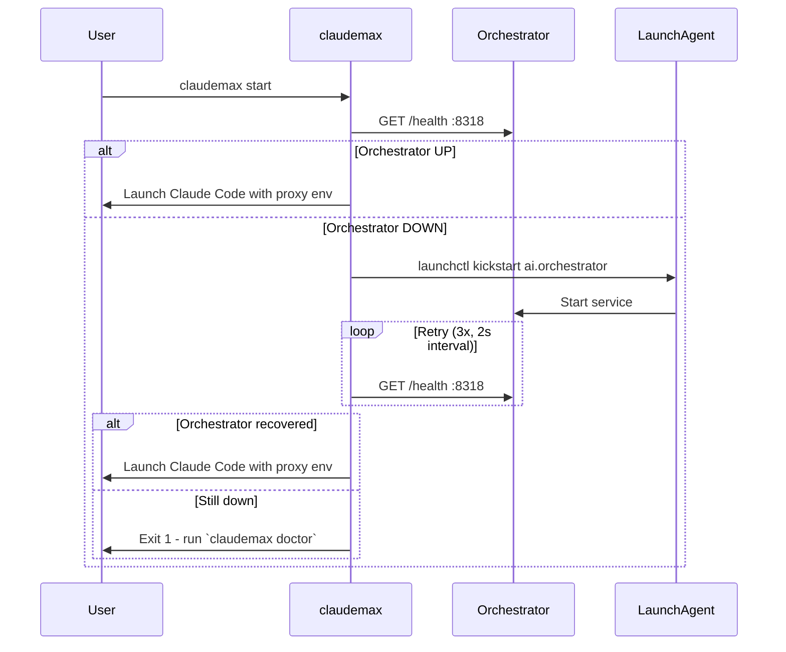

# claudemax: Optimized Claude Code Wrapper

claudemax is a shell wrapper around `claude` that adds three things: orchestrator-backed routing, isolated auth so proxy traffic never corrupts your real credentials, and automatic recovery when services go down.

---

## What claudemax Does

Bare `claude` talks directly to `api.anthropic.com`. claudemax redirects that traffic through the local orchestrator at `:8318`, which in turn routes to whichever provider is healthy and fastest.

```
claude      →  api.anthropic.com  (direct, no failover)
claudemax   →  :8318 (orchestrator) → :8317 (proxy) → provider pool
```

Three environment variables control this:

| Variable               | Value set by claudemax  | Purpose                                        |
| ---------------------- | ----------------------- | ---------------------------------------------- |
| `ANTHROPIC_BASE_URL`   | `http://localhost:8318` | Redirect Claude Code to orchestrator           |
| `CLAUDE_CONFIG_DIR`    | `~/.claude-proxy`       | Isolated config dir, separate from `~/.claude` |
| `ANTHROPIC_AUTH_TOKEN` | `your-proxy-key`              | Proxy auth key, not your real Anthropic token  |

---

## Why Isolation Matters

Claude Code stores auth state, session data, and config in `~/.claude/`. When you point it at a proxy, two problems emerge:

1. **Token refresh collisions**: Claude Code may attempt to refresh its OAuth token against `ANTHROPIC_BASE_URL`. If that URL is your proxy, the refresh fails - the proxy doesn't implement the OAuth endpoint. This silently logs you out of your real `claude` session.

2. **Config bleed**: Proxy-specific settings (base URL, auth key) written to `~/.claude/` affect every subsequent `claude` invocation, not just the proxied ones.

claudemax sets `CLAUDE_CONFIG_DIR=~/.claude-proxy` so all proxy-session state lands in a separate directory. Your real `~/.claude/` is never touched.

```
~/.claude/          ← your real account, untouched by claudemax
~/.claude-proxy/    ← proxy session state, ephemeral auth
```

Initialize the isolated config once:

```bash
mkdir -p ~/.claude-proxy
# claudemax will populate it on first run
```

---

## Recovery Flow

When you run `claudemax`, it health-checks the orchestrator before launching Claude Code. If the orchestrator is down, it triggers a LaunchAgent restart and retries.



The retry is fast (3 attempts, 2-second intervals). Total recovery overhead is under 10 seconds in the common case where the LaunchAgent is loaded but the process crashed.

---

## claudemax vs claude vs clauded

| Command     | Routes through                  | Auth                         | Failover | When to use                          |
| ----------- | ------------------------------- | ---------------------------- | -------- | ------------------------------------ |
| `claudemax` | Orchestrator :8318 → proxy pool | Isolated (`~/.claude-proxy`) | Yes      | Normal coding work                   |
| `claude`    | Direct Anthropic API            | Real account (`~/.claude`)   | No       | When proxy is intentionally bypassed |
| `clauded`   | Direct Anthropic API            | Real account (`~/.claude`)   | No       | Vanilla sessions, no permissions     |

Use `claudemax` by default. Use `claude` when you need to act on your real Anthropic account (billing, project management, settings). Use `clauded` when you explicitly want no proxy, no permissions - audit work or sensitive contexts.

Never mix: do not run `claudemax` and `claude` in the same terminal session after setting `ANTHROPIC_BASE_URL` manually - the env var will leak.

---

## Doctor Command

`claudemax doctor` runs a pre-flight check and reports status for each layer:

```bash
claudemax doctor
```

Output:

```
claudemax doctor
─────────────────────────────────────
CLIProxyAPI    :8317   ✓  healthy (4 providers, 0 excluded)
Orchestrator   :8318   ✓  healthy (18 accounts active)
Isolated auth  ~/.claude-proxy   ✓  exists, not contaminated
ANTHROPIC_BASE_URL   http://localhost:8318   ✓
CLAUDE_CONFIG_DIR    ~/.claude-proxy         ✓
ANTHROPIC_AUTH_TOKEN your-proxy-key                ✓
─────────────────────────────────────
All checks passed. Run: claudemax start
```

Failure modes it detects:

| Failure                  | Output                                         | Fix                                        |
| ------------------------ | ---------------------------------------------- | ------------------------------------------ |
| CLIProxyAPI not running  | `✗  connection refused :8317`                  | `launchctl kickstart ai.cliproxyapi`       |
| Orchestrator not running | `✗  connection refused :8318`                  | `launchctl kickstart ai.orchestrator`      |
| Isolated dir missing     | `✗  ~/.claude-proxy not found`                 | `mkdir -p ~/.claude-proxy`                 |
| Real creds in proxy dir  | `✗  ~/.claude-proxy contains real oauth token` | Delete `~/.claude-proxy/` and reinitialize |
| Wrong auth token         | `✗  ANTHROPIC_AUTH_TOKEN is not your-proxy-key`      | Check claudemax script env block           |

---

## Shell Script

The full claudemax script. Drop it at `/usr/local/bin/claudemax`:

```bash
#!/usr/bin/env bash
set -euo pipefail

ORCHESTRATOR_URL="http://localhost:8318"
PROXY_CONFIG_DIR="${HOME}/.claude-proxy"
PROXY_AUTH_TOKEN="your-proxy-key"
LAUNCH_LABEL="ai.orchestrator"
MAX_RETRIES=3
RETRY_INTERVAL=2

check_health() {
  curl -sf "${ORCHESTRATOR_URL}/health" > /dev/null 2>&1
}

try_restart() {
  launchctl kickstart -k "gui/$(id -u)/${LAUNCH_LABEL}" 2>/dev/null || true
}

cmd="${1:-}"

if [[ "$cmd" == "doctor" ]]; then
  echo "claudemax doctor"
  echo "─────────────────────────────────────"
  curl -sf http://localhost:8317/health > /dev/null 2>&1 \
    && echo "CLIProxyAPI    :8317   ✓  healthy" \
    || echo "CLIProxyAPI    :8317   ✗  connection refused"
  check_health \
    && echo "Orchestrator   :8318   ✓  healthy" \
    || echo "Orchestrator   :8318   ✗  connection refused"
  [[ -d "$PROXY_CONFIG_DIR" ]] \
    && echo "Isolated auth  ${PROXY_CONFIG_DIR}   ✓  exists" \
    || echo "Isolated auth  ${PROXY_CONFIG_DIR}   ✗  missing - run: mkdir -p ${PROXY_CONFIG_DIR}"
  exit 0
fi

# Ensure isolated config dir exists
mkdir -p "$PROXY_CONFIG_DIR"

# Health check with auto-recovery
if ! check_health; then
  echo "claudemax: orchestrator down, attempting restart..."
  try_restart
  for i in $(seq 1 $MAX_RETRIES); do
    sleep $RETRY_INTERVAL
    if check_health; then
      echo "claudemax: orchestrator recovered"
      break
    fi
    if [[ $i -eq $MAX_RETRIES ]]; then
      echo "claudemax: orchestrator did not recover - run 'claudemax doctor'"
      exit 1
    fi
  done
fi

# Launch Claude Code with proxy environment
exec env \
  ANTHROPIC_BASE_URL="$ORCHESTRATOR_URL" \
  CLAUDE_CONFIG_DIR="$PROXY_CONFIG_DIR" \
  ANTHROPIC_AUTH_TOKEN="$PROXY_AUTH_TOKEN" \
  claude "$@"
```

---

## Common Issues

**"claudemax hangs at startup"** - Orchestrator is up but unhealthy (returning 5xx). `claudemax doctor` will show this. Check orchestrator logs: `launchctl log show ai.orchestrator`.

**"Claude Code asks me to log in every time"** - The isolated config dir (`~/.claude-proxy`) is being cleared between sessions. Check if a cleanup script is removing it, or if it's in a tmpfs path.

**"My normal `claude` command now routes to the proxy"** - `ANTHROPIC_BASE_URL` leaked into your shell environment. Run `unset ANTHROPIC_BASE_URL` and check your shell profile for any claudemax env exports at the top level.

**"your-proxy-key returns 401"** - The proxy auth key in claudemax doesn't match the key in `services/cliproxyapi/config.yaml`. They must be identical. Update the config, not the script.
