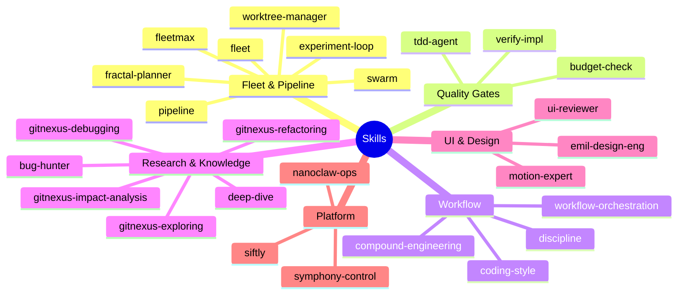
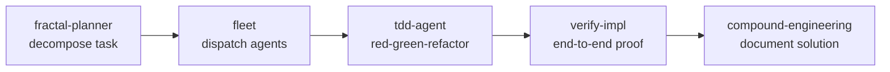
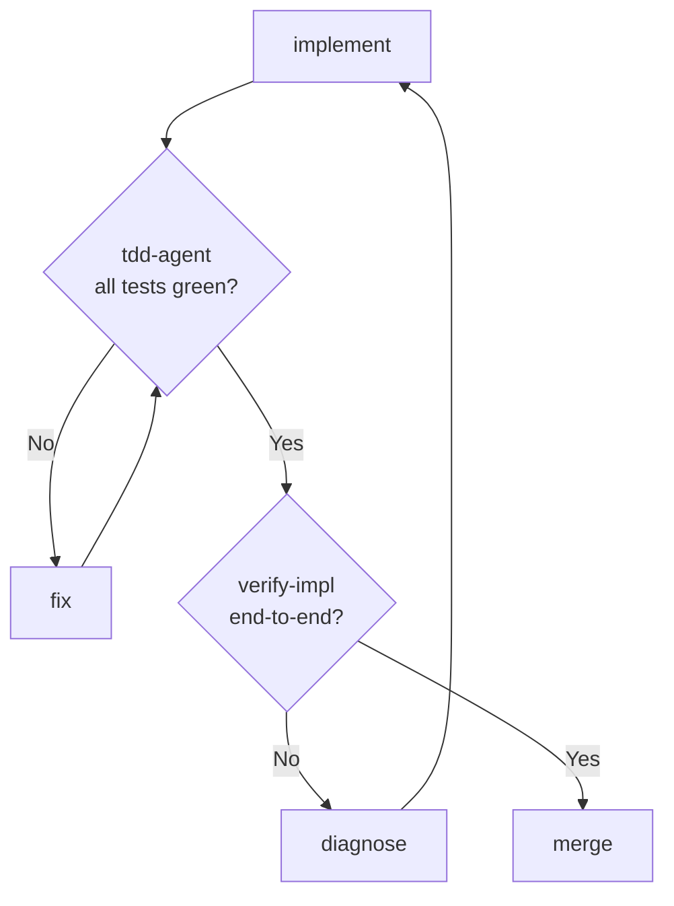

# Skill Trees and Composition

Skills are markdown files injected into an AI agent's context when invoked. They contain no code - just structured instructions, workflow steps, examples, and anti-patterns. The agent interprets them and shapes its behavior accordingly.

Skills live in `~/.claude/skills/<name>/SKILL.md`. Auto-trigger rules in `~/.claude/rules/` determine when they fire.

---

## What Skills Are Not

- Not plugins. No execution environment, no API surface.
- Not persistent. Each session loads skills fresh from disk.
- Not automatic. They require either an explicit `/skill-name` invocation or a matching auto-trigger rule.

A skill is a compressed behavior specification. The constraint is context window budget (~500 lines per skill, hard-enforced by the context-budget-governor hook).

---

## Skill Taxonomy



---

## Composition Patterns

Skills compose in four patterns depending on the task shape.

### Sequential Pipeline

Each skill hands off to the next. Used for linear feature delivery.

```
fractal-planner → fleet (dispatch) → tdd-agent → verify-impl → compound-engineering
```



### Fan-Out / Parallel

fractal-planner decomposes a task into N subtasks, fleet dispatches them in parallel, results are collected and merged.

```
fractal-planner → [fleet agent 1, fleet agent 2, ... fleet agent N] → merge
```

Limit: 4-5 concurrent agents to avoid provider rate limits. fractal-planner enforces this via `max_parallel` in its workflow.

### Gated

Quality gates block progression until criteria are met. tdd-agent enforces red-green-refactor. verify-impl refuses to sign off without real test output.



RALPH (the fleet pipeline's self-correction loop) implements this gating at the infrastructure level. Skills shape the agent behavior inside each gate.

### Escalation

budget-check gates expensive operations before they run. It reads current spend, compares to the session ceiling, and blocks if the ceiling would be exceeded.

```
[any expensive operation] → budget-check → proceed / abort with report
```

The `compound-engineering` skill triggers at the end of non-trivial problem-solving sessions to document the solution via claude-mem, so the work is not lost.

---

## Auto-Trigger Rules

Rules in `~/.claude/rules/` define conditions under which skills fire automatically. The agent evaluates these at each decision point.

```
~/.claude/rules/
├── fractal-planner.md      # 3+ parallel steps → /fractal-planner
├── bug-hunter.md           # "bug", "broken", "failing" → /bug-hunter
├── fleetmax-auto-trigger.md # multi-agent + quality gates → /fleetmax
├── gitnexus-auto-trigger.md # "why failing?", stack traces → /gitnexus-debugging
├── ui-expert-routing.md    # Figma/UI/motion keywords → ui-expert-router
└── workflow-orchestration.md # 3+ steps → plan mode first
```

Examples:

| Trigger condition                       | Auto-invoked skill       | Signal                    |
| --------------------------------------- | ------------------------ | ------------------------- |
| 3+ distinct parallelizable steps        | `fractal-planner`        | Task decomposition        |
| "bug", "broken", "failing", stack trace | `bug-hunter`             | Adversarial bug discovery |
| Multi-repo + quality gates needed       | `fleetmax`               | Orchestration required    |
| "Why is X failing?", error message      | `gitnexus-debugging`     | Call chain tracing        |
| Figma URL, "polish", "motion"           | `ui-expert-router`       | Design implementation     |
| Task involves 3+ steps                  | `workflow-orchestration` | Plan before build         |

Auto-triggers are NOT keyword matching. The agent reads the full rule file and makes a judgment. A rule that says "trigger on 3+ steps" will not fire for "fix this typo" even if the user writes three sentences about it.

---

## Creating Custom Skills

Template:

```markdown
# Skill Name

## Trigger

When to use this skill. Be specific - vague triggers cause false positives.

## Workflow

1. Step one. What the agent does, not what to say.
2. Step two.
3. Step three.
   Include decision branches: "If X, do Y. If Z, do W."

## Checklist

- [ ] Concrete verifiable item
- [ ] Another item
- [ ] Never claim completion without [specific output]

## Examples

### Works well for

- Concrete scenario A
- Concrete scenario B

### Does NOT apply to

- Anti-pattern A (use [other-skill] instead)
- Anti-pattern B

## Output Format

Describe what the agent should produce. Tables, code blocks, prose - be explicit.
```

Rules for custom skills:

1. **One responsibility.** If you're writing two distinct workflows in one skill, split it.
2. **Under 500 lines.** The context-budget-governor will truncate or reject longer skills.
3. **No secrets.** Skills are markdown files in a repo. Treat them as public.
4. **Verifiable checklist.** Every skill needs at least one "show real output" checklist item. Otherwise agents will claim completion without proof.
5. **Anti-patterns section is mandatory.** Tell the agent when NOT to use this skill.

Deploy to `~/.claude/skills/<name>/SKILL.md`. To make it auto-trigger, add a rule file to `~/.claude/rules/<name>.md`.

---

## Skill Cost

Each loaded skill consumes context window tokens. Budget per skill: ~500 lines ≈ ~3,000–5,000 tokens.

At 200K context window (claude-sonnet-4-5):

| Loaded skills | Tokens consumed | Remaining for code/conversation |
| ------------- | --------------- | ------------------------------- |
| 0             | 0               | 200K                            |
| 5             | ~25K            | ~175K                           |
| 10            | ~50K            | ~150K                           |
| 20            | ~100K           | ~100K                           |
| 40+           | ~200K           | None - context overflow         |

The context-budget-governor hook enforces the 500-line limit at load time and warns when total skill load exceeds 50K tokens.

**Never load all skills by default.** Load on demand via explicit invocation or auto-trigger. The always-loaded set (via CLAUDE.md or rules/) should be under 5 skills for normal sessions.

### The fullstackOS skill hierarchy

Skills are indexed in `docs/context/skill-hierarchy.md`. As of the current index:

| Category                           | Count | Load strategy            |
| ---------------------------------- | ----- | ------------------------ |
| Local skills (`~/.claude/skills/`) | 47    | On-demand / auto-trigger |
| Plugin skills (via MCP tools)      | 42    | MCP-invoked only         |
| Always-loaded (CLAUDE.md injected) | ~3    | Session start            |

No collisions between local and plugin skill namespaces. If you add a local skill with the same name as a plugin skill, the local one takes precedence.

---

## Skill Interaction with the Fleet Pipeline

When fleet agents run inside the pipeline, they inherit the skill context of the session that dispatched them - unless explicitly overridden. This means:

- A session with `tdd-agent` loaded will dispatch agents that also enforce red-green-refactor.
- A session with `coding-style` loaded will dispatch agents that follow the same style rules.
- Skills are propagated via the agent config's `systemPrompt` field at dispatch time.

To give a dispatched agent a different skill set, specify it in the `agent_config` when calling `ai-fleet team`:

```bash
ai-fleet team "Refactor auth module" \
  --skills "tdd-agent,verify-impl" \
  --no-inherit-session-skills
```

`--no-inherit-session-skills` prevents session skills from propagating. Without it, dispatched agents get the full session skill context, which may be expensive for long-running fleet jobs.
