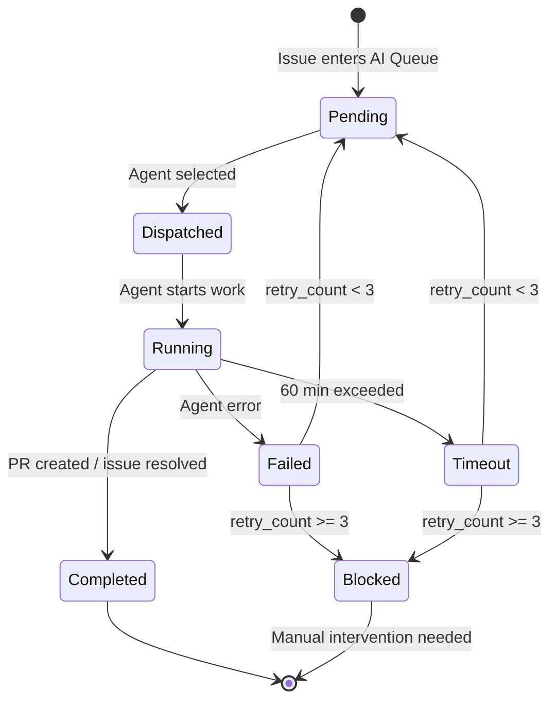

# Symphony: Autonomous Coding with Linear

Symphony is the bridge between your planning tool and your AI fleet. You file issues in Linear. Symphony watches the board, classifies each issue, selects a model, and dispatches an agent. You come back to PRs.

---

## Why Symphony Exists

The manual loop looks like this: write an issue, copy the description into a terminal, pick a model, start an agent, wait, check results, repeat. At scale - ten issues a week - this is the bottleneck.

Symphony closes that loop. It polls Linear on a fixed interval, picks up issues that enter your "AI Queue" status, decides which agent to dispatch based on complexity signals, runs the job through the fleet pipeline, and writes results back to Linear. The issue moves from Queued to Dispatched to Completed without you touching it.

The core architectural assumption: **Linear is the single source of truth for what work needs doing.** Symphony is a daemon that acts on that truth.

---

## Prerequisites

Before starting:

- Linear account with personal or workspace API key
- Team configured with a dedicated status (e.g., "AI Queue") that acts as the dispatch trigger
- At least one repo with Linear label conventions established (labels map to repos)
- Orchestrator running at `:8318` for model routing
- Fleet pipeline installed (`services/fleet/`) for agent dispatch

---

## Setup

### 1. Get a Linear API key

Go to Linear Settings > API > Personal API Keys. Create a key scoped to the workspace. Copy it - you will not see it again.

```bash
# Verify the key works
curl -s -H "Authorization: YOUR_KEY" \
  -H "Content-Type: application/json" \
  -d '{"query": "{ viewer { id name } }"}' \
  https://api.linear.app/graphql | jq .
```

### 2. Configure your team and AI Queue status

In Linear, open your team settings and create a workflow status named `AI Queue` (or any name you choose - you will reference it by ID). Note the team ID from the URL: `https://linear.app/your-org/team/TEAM_ID/`.

Create labels for each repo you want Symphony to handle. Example: `repo:api`, `repo:frontend`, `repo:infra`. These labels are what REPO_MAP uses to resolve dispatch targets.

### 3. Set environment variables

```bash
export LINEAR_API_KEY="lin_api_..."
export LINEAR_TEAM_ID="TEAM_ID_FROM_URL"
export LINEAR_QUEUE_STATUS="AI Queue"   # exact status name
export SYMPHONY_POLL_INTERVAL=60        # seconds between polls
export SYMPHONY_MAX_RETRIES=3
export STATE_DB="$HOME/.agent-gateway/symphony-state.db"
```

For persistent operation, add these to your shell profile or a `.env` file sourced by the LaunchAgent.

### 4. Configure REPO_MAP

REPO_MAP is a JSON object that maps Linear labels to absolute repo paths on the dispatch machine. Symphony uses this to `cd` into the right directory before running the agent.

```json
{
  "repo:api": "~/Dev/myproject/api",
  "repo:frontend": "~/Dev/myproject/frontend",
  "repo:infra": "~/Dev/fullstackOS",
  "repo:data-pipeline": "~/Dev/myproject/data"
}
```

Set this via environment variable (JSON-encoded) or a config file:

```bash
export REPO_MAP='{"repo:api":"~/Dev/myproject/api","repo:frontend":"~/Dev/myproject/frontend"}'
```

If an issue has no matching label, Symphony logs a warning and leaves the issue in AI Queue rather than silently discarding it.

### 5. Start the poller

```bash
python3 services/symphony/symphony-poller.py
```

On first start it creates the SQLite state DB and begins polling. You will see log lines like:

```
[symphony] poll #1: 0 new issues
[symphony] poll #4: 1 new issue - XKO-42 "Add rate limiting to /api/messages"
[symphony] XKO-42: complexity=standard, model=codex-5.2, repo=repo:api
[symphony] XKO-42: dispatched → fleet job a3f9c1
```

### 6. Install as LaunchAgent (always-on)

For autonomous operation, install Symphony as a LaunchAgent so it survives reboots and restarts on failure:

```bash
cp launchd/ai.symphony.poller.plist ~/Library/LaunchAgents/
launchctl load ~/Library/LaunchAgents/ai.symphony.poller.plist
launchctl start ai.symphony.poller
```

Verify it is running:

```bash
launchctl list | grep symphony
# Should show PID (non-zero) and exit status 0
```

Logs write to `~/Library/Logs/symphony-poller.log`.

---

## State Machine

Every issue Symphony touches moves through the following states. The state is tracked both in Linear (via status transitions) and in the local SQLite DB (for history and retry logic).



The `failure_count` column in the state DB tracks retries per issue. On third failure, the issue is moved to "Blocked" in Linear and Symphony stops touching it. A comment is added to the issue with the last error.

---

## Complexity Routing

Symphony classifies each issue before dispatching. Classification uses title keywords, description length, and label signals. The routing table:

| Complexity | Signals                                             | Model        | Agent                             |
| ---------- | --------------------------------------------------- | ------------ | --------------------------------- |
| Trivial    | typo, config, rename, bump, pin                     | gemini-flash | inline (no fleet)                 |
| Standard   | feature, refactor, test, add, update, fix           | codex-5.2    | codex or claude via fleet         |
| Complex    | architecture, security, migration, design, breaking | opus         | claude via fleet with review gate |

Classification is not perfect - you can override it by adding a label to the issue:

- `complexity:trivial` - force trivial routing
- `complexity:standard` - force standard routing
- `complexity:complex` - force complex routing, always uses claude + review gate

When in doubt, Symphony routes up (ambiguous → standard, not trivial).

---

## REPO_MAP in Detail

The label-to-path mapping supports one label per issue for dispatch. If an issue has multiple repo labels, Symphony uses the first match in the order REPO_MAP is defined.

Example with four repos:

```json
{
  "repo:api": "~/Dev/acme/api",
  "repo:frontend": "~/Dev/acme/frontend",
  "repo:shared-types": "~/Dev/acme/packages/types",
  "repo:infra": "~/Dev/fullstackOS"
}
```

The agent is dispatched with `cwd` set to the mapped path. The fleet pipeline handles `git checkout -b`, the actual edits, `git push`, and PR creation.

---

## Monitoring

**Live status:**

```bash
symphony-ctl status
# Shows: running/stopped, last poll time, active jobs, queue depth
```

**Recent dispatch history:**

```bash
symphony-ctl logs
# Last 20 dispatch events with issue IDs, models, outcomes
```

**Queue view:**

```bash
symphony-ctl queue
# All issues currently in AI Queue or Dispatched state
```

**Move an issue manually:**

```bash
symphony-ctl move XKO-42 pending   # reset to retry
symphony-ctl move XKO-42 blocked   # suppress retries
```

**Force retry a blocked issue:**

```bash
symphony-ctl retry XKO-42
# Resets failure_count to 0, moves to Pending
```

**Full history (SQLite):**

```bash
sqlite3 ~/.agent-gateway/symphony-state.db \
  "SELECT issue_id, status, model, failure_count, updated_at FROM issues ORDER BY updated_at DESC LIMIT 20;"
```

---

## Operational Notes

- Symphony does not create branches or commit code itself. It dispatches to the fleet pipeline, which handles all git operations.
- The Linear GraphQL API requires `ID!` types for entity ID variables - not `String!`. If you write custom queries, use the correct type or mutations will silently fail.
- Poll interval defaults to 60 seconds. For overnight batches, 120-300 seconds is sufficient and reduces API usage.
- If Orchestrator at `:8318` is unreachable, Symphony logs a warning and retries the poll without dispatching. It does not fall back to direct model calls.
- State DB path is controlled by the `STATE_DB` environment variable. Default: `~/.agent-gateway/symphony-state.db`.
