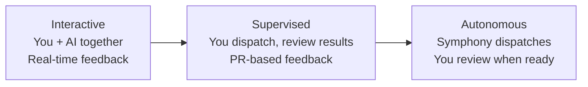
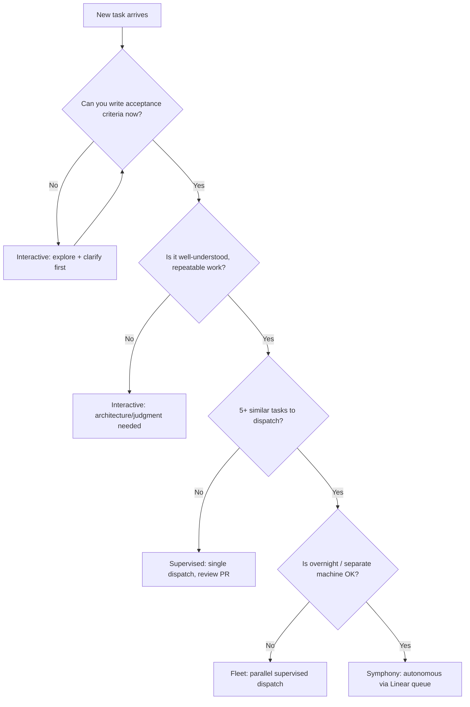

# The Theory of Interactive vs Autonomous Coding

There is no single right mode for working with AI agents. The question is not "should I use AI" but "which mode of AI use fits this task." Getting that wrong in either direction wastes time: interactive mode on a well-specified batch task is just overhead; autonomous mode on an ambiguous architecture problem produces work you have to undo.

This doc maps the decision space.

---

## The Spectrum



These are not hard categories. Most real work moves along this line depending on how well the task is understood. A feature starts interactive (architecture decision), moves to supervised (implementation), and finishes autonomous (write tests for all edge cases).

---

## Interactive Mode

**Tools:** `claudemax`, `claude` in terminal, direct chat

**What it is:** You and the model share a context window. You see every step. You steer in real time. The model produces output you can immediately evaluate and redirect.

**Use when:**

- Exploring code you have not seen before. The model asks questions and follows threads; you correct wrong assumptions as they happen.
- Making architecture decisions. The right answer depends on constraints the model cannot discover from code alone - team conventions, migration cost, downstream plans.
- Debugging complex, multi-layer failures. You provide runtime context (logs, stack traces, state) that no autonomous system has access to.
- Code review and learning. You want to understand why, not just get the output.
- Tasks where correctness depends on taste or judgment that has not been encoded anywhere.

**Cost of getting it wrong:** Low. You are there to catch mistakes in real time. The cost is your time, not runaway agent loops.

**Signs you are using interactive when you should not:**

- You are copy-pasting the same spec into the terminal for the fifth time this week.
- The task is well-specified enough that your only job is reading the output and typing "looks good."
- You are doing this while the model is working, rather than thinking alongside it.

---

## Supervised Dispatch

**Tools:** `fleet`, `fleetmax`, direct agent dispatch with PR review

**What it is:** You write a spec, dispatch an agent, and review the PR when it is done. You are not present during execution. Your feedback loop is async - you see the result, not the process.

**Use when:**

- The acceptance criteria can be written clearly upfront. If you cannot write a passing test before dispatching, the task is not ready for supervised dispatch.
- Parallel work: ten modules need test coverage added. Writing the same spec ten times interactively is waste. Dispatch ten agents in parallel.
- Repetitive tasks where the pattern is established (add an endpoint, update a schema, extract a component to match an existing one).
- You have a working test suite. Without tests, "supervised" is just "autonomous with optimism."

**The spec requirement is hard.** If you cannot describe what done looks like in a way the RALPH loop can verify (i.e., tests pass, linter passes, PR description is accurate), do not dispatch supervised. Write the spec interactively first, then dispatch.

**Cost of getting it wrong:** Medium. A bad spec produces a PR you reject. You lose the agent's compute time, not your time. With RALPH, test failures auto-cycle; review failures surface for you to redirect.

---

## Autonomous Mode (Symphony)

**Tools:** Symphony poller, Linear as task queue

**What it is:** You do not dispatch at all. Linear issues flow into Symphony's AI Queue, Symphony classifies and dispatches, agents work, PRs are created. You review at some later point - hours later, morning-after, end of sprint.

**Use when:**

- Issues are already triaged and labeled. Symphony works from your existing planning process; it does not replace the planning.
- Work runs overnight or on a separate machine, avoiding resource contention with your active session.
- You dispatch five or more tasks per day and the dispatch overhead has become noticeable.
- You have confidence in the test suites. Autonomous work with no automated verification is not autonomous - it is deferred liability.
- The work is well within the complexity tier Symphony handles reliably (trivial and standard). For complex/architecture issues, route through supervised at minimum.

**Cost of getting it wrong:** High. A bad autonomous run can produce multiple PRs on wrong branches, consume significant model budget, and create review debt. The mitigation is tight issue quality, not post-hoc checking.

---

## Same Machine vs Separate Machine

| Concern             | Same Machine                          | Separate Machine (production server)          |
| ------------------- | ------------------------------------- | ------------------------------------ |
| Setup complexity    | Low - no network config               | Higher - SSH, Tailscale, sync        |
| Resource contention | Agent work competes with your session | Dedicated hardware, no contention    |
| Latency to results  | Immediate                             | PR shows up when sync completes      |
| Recommended for     | Getting started, low dispatch volume  | 5+ dispatches/day, overnight batches |
| Cost                | Your machine's compute                | Second machine's compute             |

Start same-machine. The right time to graduate to a separate dispatch machine is when you notice agent jobs degrading your interactive session performance, or when you want overnight autonomous work without leaving your laptop running.

Sync model: agents push branches to remote; you pull and review on your machine. Git is the transport layer. No shared filesystem required.

---

## The RALPH Safety Net

Autonomous coding requires a self-correction layer because no agent gets everything right on the first attempt. RALPH (Retry And Loop with Hardened Preconditions) is that layer.

How it works in the fleet pipeline:

```
Test failure:   test → fix → test (up to max_retries)
Review failure: review → implement → test → fix → review → merge → deploy
```

What RALPH catches:

- Test failures auto-cycle to a fix stage without surfacing to you
- Review gate failures route back through implementation before re-review
- Budget guards terminate runs that exceed cost limits
- Circuit breakers stop cycles that exceed retry limits and surface as Blocked

What RALPH does not catch:

- Spec ambiguity. If the issue is underspecified, RALPH cycles until it hits retry limits.
- Wrong test coverage. Tests that do not exercise the changed code do not protect you.
- Taste failures. Code that passes tests but does not match your conventions requires human review.

The practical implication: RALPH raises the floor on autonomous work quality, but does not eliminate review. Plan to review every autonomous PR before merging.

---

## Cost Model

These are rough estimates based on observed usage patterns. Actual costs vary by model tier and task complexity.

| Mode                  | Daily cost | When justified                      |
| --------------------- | ---------- | ----------------------------------- |
| Interactive only      | $5-15      | Learning, architecture, debugging   |
| Supervised dispatch   | $10-30     | Execution phase of planned features |
| Autonomous (Symphony) | $20-50     | Sustained development at volume     |

Break-even for autonomous: if Symphony saves two or more hours of manual dispatch and review overhead per day, the cost is justified. At lower volumes, supervised dispatch gives most of the benefit at lower spend.

The cost of interactive is primarily your time. The cost of autonomous is primarily compute. Neither is categorically better - the question is which resource you are trying to preserve.

---

## Decision Flowchart


