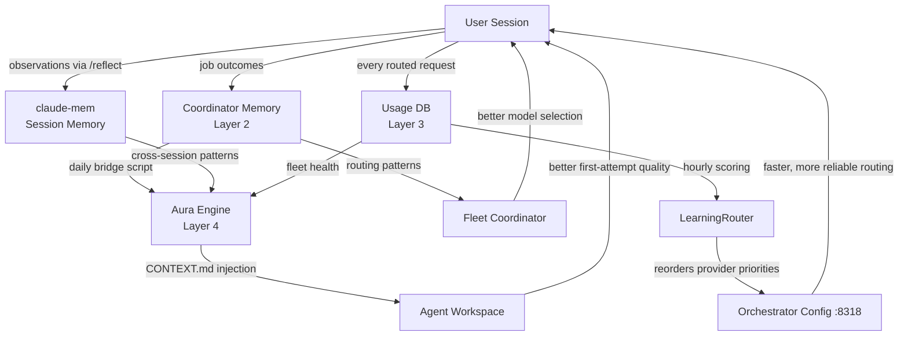

# Memory and Learning Systems

fullstackOS maintains five distinct memory layers. Each operates at a different timescale and serves a different consumer. Together they form a feedback loop: observations from your sessions influence routing decisions, which improve agent quality, which produce better outcomes for the next session.

---

## Overview

| Layer                       | Storage            | Timescale      | Consumer                            |
| --------------------------- | ------------------ | -------------- | ----------------------------------- |
| Session Memory (claude-mem) | SQLite + vectors   | Cross-session  | You (context injection)             |
| Coordinator Learning        | SQLite             | Per-request    | Fleet coordinator (routing)         |
| Orchestrator Usage DB       | SQLite             | Hourly scoring | LearningRouter (provider selection) |
| Aura Context Engine         | 9 DBs + JSON cache | 30-min refresh | Agent workspace (CONTEXT.md)        |
| Skill Metrics               | SQLite             | Per-invocation | Skill optimizer                     |

---

## Layer 1: Session Memory (claude-mem)

**What it stores:** Observations from your interactive sessions - decisions made, patterns noticed, things that worked or did not.

**How it works:**

- You or the model write observations via `/reflect` or the compound workflow
- Stored in SQLite with vector embeddings for semantic search
- At session start, a SessionStart hook queries the vector store for context relevant to the current project and task
- Haiku-powered compression trims retrieved context to fit within the active context window

**What this gives you:**

A new session in a project you have not touched in three weeks can still surface: "last time you worked on the auth module, you hit a bug with token refresh on concurrent requests." That context is not in the current conversation - it was injected from memory.

**Key paths:**

- DB: `~/.claude/memory/` (SQLite + embeddings)
- Hook: `~/.claude/hooks/session-start.sh`
- Write: `/reflect` command, `/workflows:compound`

---

## Layer 2: Coordinator Learning Memory

**What it stores:** Routing patterns - which model/agent worked for which type of task in which repo, and which failed.

**How it works:**

- Every completed fleet job writes an outcome record: repo, task type, model, success/failure, retry count
- The `global_learning` table stores derived rules with confidence scores
- Before the coordinator routes a new job, it queries this table for matching patterns
- Confidence degrades over time; old patterns expire unless reinforced

**Example patterns stored:**

```
repo=api, task_type=refactor → model=codex-5.2      confidence=0.91
repo=api, task_type=migration → model=claude-opus    confidence=0.87
repo=frontend, complexity=standard → agent=codex    confidence=0.78
provider=antigravity, time=09:00-11:00 → latency_high  confidence=0.83
```

The last example is a temporal pattern: if antigravity is consistently slow during peak hours, the coordinator routes around it during that window.

**Key paths:**

- DB: `~/.ai-fleet/coordinator/memory.db`
- Table: `global_learning (pattern, value, confidence, last_seen, hit_count)`
- Read: coordinator pre-routing query
- Write: fleet job completion handler

---

## Layer 3: Orchestrator Usage DB

**What it stores:** Every request routed through the orchestrator - model, provider, token counts, latency, success/failure, timestamp.

**How it works:**

- Every request to `:8318` logs a usage record on completion
- The LearningRouter runs hourly, reading a 24-hour sliding window
- It scores each provider on: success rate, P95 latency, error rate, cost per token
- Scores update the provider priority ordering in the active orchestrator config
- No restart required - priority reordering is hot-applied

**What this prevents:**

A provider that starts returning 429s at 14:00 every day (common with free-tier APIs) will have its score drop below the threshold by 14:30, and traffic shifts to the next provider automatically. Without this layer, every session that hits the degraded provider fails until you manually intervene.

**Key paths:**

- DB: `~/.ai-fleet/orchestrator/usage.db`
- Table: `requests (model, provider, tokens_in, tokens_out, latency_ms, success, created_at)`
- LearningRouter: `services/orchestrator/src/learning-router.ts`
- Scoring interval: hourly cron

---

## Layer 4: Aura Context Engine

**What it stores:** A synthesized, time-aware snapshot of your current state - active tasks, recent decisions, fleet health, memory patterns from all other layers.

**How it works:**

- Reads from nine memory databases in parallel
- Applies time-of-day weighting: morning sessions get planning and priority hints; evening sessions get wrap-up and review hints
- Output is written to `~/.agent-gateway/aura/context-cache.json`
- A separate script converts the cache to Markdown (`CONTEXT.md`) and copies it into the agent workspace/sandbox
- Cron precomputes every 30 minutes; agents read the cached version (not live)

**The nine sources Aura reads:**

| Source DB          | Data                                          |
| ------------------ | --------------------------------------------- |
| `code-context`     | 143 repo summaries, recent file activity      |
| `metrics`          | Fleet job outcomes, error rates               |
| `tasks`            | Pending tasks (14 at last count)              |
| `knowledge`        | Coordinator learnings, cross-session patterns |
| `symphony`         | Recent dispatch history (50 runs)             |
| `sentinel`         | Security/anomaly flags                        |
| `crm`              | Contact and org context                       |
| `social-analytics` | X/Telegram signals                            |
| `test_results`     | Recent test suite outcomes per repo           |

**What agents see:**

A `CONTEXT.md` file injected into their sandbox before they start work. It contains: current time and inferred session phase, active task priorities, recent relevant decisions, fleet health summary. The agent does not need to discover this context - it is handed to them.

**Key paths:**

- Engine: `~/.agent-gateway/aura/engine.py`
- Cache: `~/.agent-gateway/aura/context-cache.json`
- Workspace injector: `~/.agent-gateway/scripts/aura-workspace-inject.sh`
- Cache-to-Markdown: `~/.agent-gateway/scripts/aura-cache-to-md.py`
- Sandbox target: `CONTEXT.md` in active agent sandbox

---

## Layer 5: Skill Metrics

**What it stores:** Per-skill invocation counts, success/failure rates, latency, and last-used timestamps.

**How it works:**

- Every skill invocation (via `/` command or agent tool call) writes a metric record
- A weekly job reads the metrics and flags: skills with zero invocations in 30 days, skills with >20% failure rate, skills invoked frequently but with low success
- Output is a report surfaced in the morning digest

**What this enables:**

- Drop unused skills to reduce context overhead (skills loaded on demand, but their presence in the index still costs tokens at session start)
- Identify skills that need prompt fixes (high invocation, low success = broken skill)
- Discover emerging needs (a skill with sudden invocation spike = something changed in your workflow)

**Key paths:**

- DB: `~/.claude/skills/metrics.db`
- Table: `invocations (skill_name, success, latency_ms, error, created_at)`
- Weekly report: `scripts/skill-metrics-report.py`

---

## Feedback Loops

The five layers are not independent. Observations from one feed decisions in another.



The loop closes: better routing reduces retries, fewer retries produce cleaner outcomes, cleaner outcomes reinforce patterns in coordinator memory, which improves the next dispatch.

---

## Maintenance

**Clear stale coordinator patterns:**

```bash
sqlite3 ~/.ai-fleet/coordinator/memory.db \
  "DELETE FROM global_learning WHERE confidence < 0.3 OR last_seen < datetime('now', '-30 days');"
```

**Reset usage scoring (if a provider was misconfigured and generated false failure data):**

```bash
sqlite3 ~/.ai-fleet/orchestrator/usage.db \
  "DELETE FROM requests WHERE provider = 'target_provider' AND created_at > '2026-03-16';"
```

**Force Aura cache refresh:**

```bash
python3 ~/.agent-gateway/aura/engine.py --force-refresh
# Then reinject into sandbox
~/.agent-gateway/scripts/aura-workspace-inject.sh
```

**View skill metrics:**

```bash
python3 scripts/skill-metrics-report.py --days 30 --sort invocations
```
