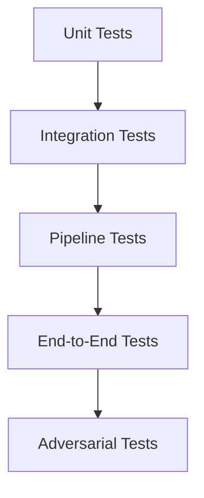
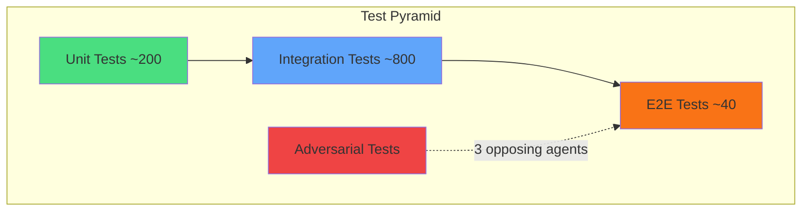
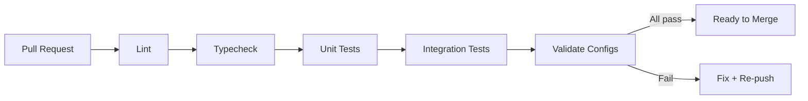

# Evaluation and Testing Strategy

## Philosophy

Tests run at two mandatory checkpoints:

1. **Post-edit** - after every meaningful code change, run the targeted test for the changed module
2. **Pre-PR** - full suite before creating or updating any pull request

Integration tests hit real services where possible. Mocks are used only for external providers that cannot be reliably reached in CI (Anthropic API, Gemini API). The test suite is the safety net for autonomous coding - when RALPH self-corrects, it runs tests to verify the fix. No tests means no self-correction.

Never claim a task complete without test output proving correctness.

---

## Test Layers



### 1. Unit Tests (~200 tests)

Individual functions in isolation. Inputs and outputs are deterministic.

- Tier classification logic - does `classifyTier("claude-opus-4-5")` return `premium`?
- Circuit breaker state transitions - failure count increments, cooldown math
- Budget calculations - daily limit logic, account parking thresholds
- Tool name translation - Gemini 64-char truncation, hyphens vs underscores

### 2. Integration Tests (~800 tests)

Multi-component interactions. Two or more real subsystems talk to each other. No external provider calls.

- Orchestrator + tier router: full request dispatch with mocked provider responses
- Pipeline + stages: task creation through stage transitions
- Budget guard + usage DB: write a usage record, confirm enforcement triggers
- CLIProxyAPI + token files: token read/refresh flow with a real filesystem

### 3. Pipeline Tests (~200 tests)

Full pipeline runs. These spin up an in-memory pipeline engine and run tasks through it.

- RALPH loops: test failure triggers fix stage, which triggers re-test
- Wave parallelism: two independent stages complete before dependent stage begins
- Dependency resolution: stage ordering from declared `depends_on` fields
- Error propagation: a failed stage correctly halts downstream stages

### 4. End-to-End Tests (~40 tests)

Real requests through the full stack. These require services to be running.

```
Orchestrator :8318 + CLIProxyAPI :8317 + Fleet Gateway :4105
```

Skipped in CI unless `RUN_E2E=true` is set. Run manually before releases.

- A real `POST /v1/messages` reaches the orchestrator and gets a response
- Provider failover: kill one provider mock, confirm request routes to backup
- Token expiry: inject a near-expired token, confirm refresh fires

### 5. Adversarial Tests

Bug hunter runs three agents with opposing strategies simultaneously:

- **Agent A** (pessimist): tries to find states that cause silent data corruption
- **Agent B** (chaos): injects random delays, partial writes, malformed JSON
- **Agent C** (boundary): probes exact limit values - max token count, 64-char tool names, midnight reset edge

Findings are filed as test cases. The adversarial suite currently has ~42 test cases derived from past bug-hunter runs.



---

## Key Test Files

| Test file                 | Tests | What it validates                                                                        |
| ------------------------- | ----: | ---------------------------------------------------------------------------------------- |
| `test_routing.py`         |   ~26 | Tier classification, content upgrades, quality floor enforcement, sub-agent routing      |
| `test_pipeline.py`        |  ~200 | Stage orchestration, RALPH loops, dependency resolution, wave parallelism                |
| `test_circuit_breaker.py` |   ~30 | Open/closed/half-open states, failure counting, cooldown timers                          |
| `test_budget.py`          |   ~15 | Daily limits, account parking, auto-reset at midnight, resume on new day                 |
| `test_nanoclaw.py`        |   ~42 | Token scanning, refresh triggering, health monitoring, state persistence across restarts |
| `test_quality_gates.py`   |   ~20 | Phase gate checks, evidence requirements, retry limits before escalation                 |
| `test_translation.py`     |   ~18 | Anthropic → OpenAI format, tool call serialization, streaming chunk translation          |
| `test_symphony.py`        |   ~35 | Linear ticket polling, task dispatch, retry limits, failure escalation to Backlog        |

---

## Memory Eval Harness

Location: `.autoresearch-memory/eval.py`

The eval system scores memory quality on three axes:

| Axis              | Weight | What it measures                                       |
| ----------------- | -----: | ------------------------------------------------------ |
| Context relevance |    40% | Does injected context match the current task's domain? |
| Recall accuracy   |    30% | Can the system retrieve past learnings when queried?   |
| Freshness         |    30% | How recent is the context cache?                       |

**Overall score** = `(relevance * 0.4) + (recall * 0.3) + (freshness * 0.3)`

Scores are written to the metrics DB and visible in the Aura dashboard. A score below 60 triggers a cache rebuild.

The eval runs nightly via cron and after any change to the Aura engine or coordinator bridge.

---

## Running Tests

### Pipeline + coordinator tests

```bash
cd fleet && python3 -m pytest ../tests/ --tb=short -q
```

Expected baseline: **1,244 tests** (990 pipeline + 254 orchestrator). Flag any regression from this count.

### Orchestrator tests

```bash
cd services/orchestrator && bun test
```

### Targeted module test (post-edit checkpoint)

```bash
# After editing routing logic
cd fleet && python3 -m pytest ../tests/test_routing.py --tb=short -q

# After editing circuit breaker
cd services/orchestrator && bun test --testPathPattern circuit_breaker
```

### Full health check

```bash
./scripts/install.sh --doctor
```

Checks: port availability, process state, env vars, token file existence, health endpoints.

### Memory eval

```bash
python3 .autoresearch-memory/eval.py --run
```

### TypeScript typecheck

```bash
bun run typecheck
```

Run this before any orchestrator PR. Type errors in provider translation functions have caused silent runtime failures.

---

## CI/CD Pipeline

The GitHub Actions workflow runs on every push and PR:

```
lint → typecheck → unit tests → integration tests → validate
```

| Stage             | Command                                                     | Fails on             |
| ----------------- | ----------------------------------------------------------- | -------------------- |
| Lint (Python)     | `ruff check --fix`                                          | Any unfixed warning  |
| Lint (TS)         | `npx eslint --fix`                                          | Any error-level rule |
| Typecheck         | `bun run typecheck`                                         | Any TS type error    |
| Unit tests        | `pytest tests/unit/ --tb=short -q`                          | Any failure          |
| Integration tests | `pytest tests/integration/ --tb=short -q`                   | Any failure          |
| Validate configs  | `python3 scripts/theorist/validate.py --root docs/theorist` | Schema violations    |

E2E tests are not in CI. They require live services and are run manually before releases.



---

## Test Discipline Rules

- `init_worktrees` must be mocked in any test that calls `stage_implement` - it writes to the real filesystem
- `_check_learned_via` must be mocked in routing tests - it reads `~/.ai-fleet/coordinator/memory.db` on the live machine
- Do not assert on exact model names in integration tests - provider routing is non-deterministic
- Budget tests must reset the usage DB before each test case - leftover state causes false failures
- RALPH cycle tests must inject a known-failing task and assert the cycle counter increments correctly
