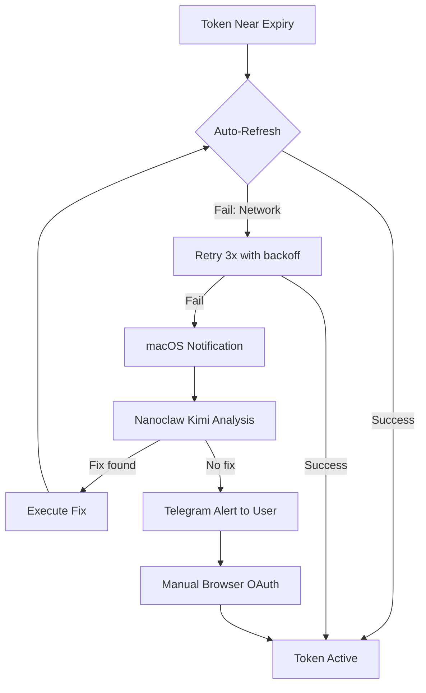
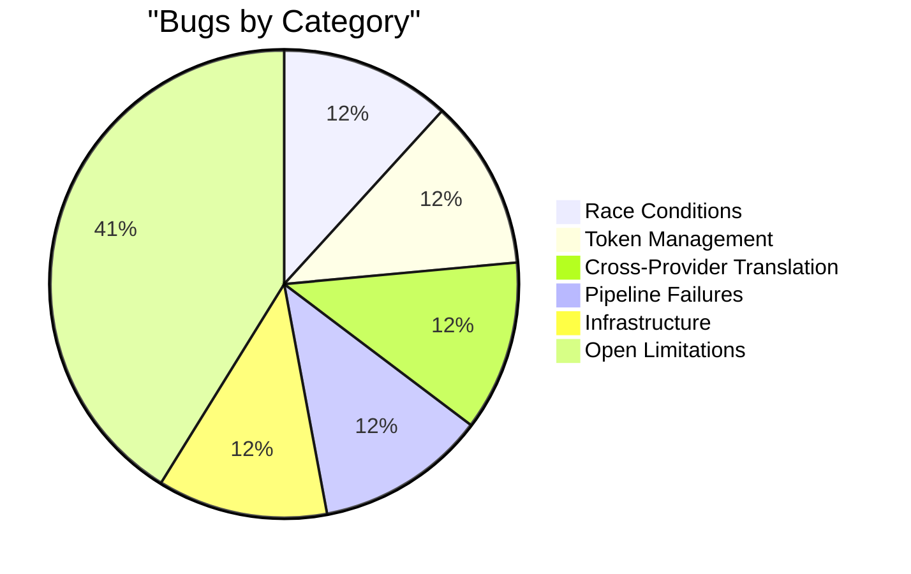

# Known Bugs, Edge Cases, and Lessons Learned

These are the bugs that made it to production, the ones caught in adversarial testing, and the ones still open. Each entry documents root cause, fix, and the generalizable lesson.

---

## Category 1: Race Conditions

### Concurrent token file writes

**Status:** Fixed

**Problem:** Two goroutines writing the same token file simultaneously produced corrupted JSON. CLIProxyAPI's refresh loop and the orchestrator's health check both wrote to the same token path. The result was a half-written file that crashed the next reader with a JSON parse error.

**Root cause:** No file-level locking. Both writers assumed they were the sole owner.

**Fix:** `fcntl.LOCK_EX` in `refreshers.py` before any write. Readers use `LOCK_SH`. Lock is always released in a `finally` block.

**Lesson:** Any file shared between processes - even on the same machine - needs explicit locking. OS-level write atomicity does not protect against partial writes by the application layer.

---

### Circuit breaker state race

**Status:** Fixed

**Problem:** Multiple concurrent requests checked circuit state simultaneously. During the window between a check (CLOSED) and a send, the circuit could open. Some requests slipped through during the OPEN state.

**Root cause:** Read-check-act was not atomic. The Bun event loop has microtask races even within a single process when async operations interleave.

**Fix:** Atomic compare-and-swap in circuit breaker state transitions. State reads and the decision to send are locked within a single synchronous block before yielding to the event loop.

**Lesson:** Circuit breakers must be thread-safe. In async JS runtimes, "single-threaded" does not mean "race-free" - microtask interleaving is real.

---

## Category 2: Token Management

### Naive datetime normalization

**Status:** Fixed

**Problem:** Some providers return timezone-aware datetimes (`2026-01-01T00:00:00+00:00`), others return naive datetimes (`2026-01-01T00:00:00`). Comparing them in Python raises `TypeError: can't compare offset-naive and offset-aware datetimes`. This crashed the token expiry check silently - the exception was caught, logged, and the token was treated as valid.

**Root cause:** No normalization step before comparison.

**Fix:** Normalize all datetimes to UTC with timezone info before any comparison. Helper: `ensure_utc(dt)` coerces naive datetimes to UTC-aware.

**Lesson:** Never trust provider date formats. Always normalize to a single representation at the system boundary. Treat naive datetimes as a schema violation.

---

### OAuth token refresh strips scopes

**Status:** Fixed

**Problem:** Google OAuth token refresh silently dropped calendar scopes if the Google Calendar API was not enabled in Cloud Console. The refresh succeeded, the new token was stored, but subsequent calendar calls failed with a 403. The error appeared unrelated to the refresh.

**Root cause:** Google's OAuth implementation silently omits scopes for APIs not enabled on the project. No error is raised. The token looks valid.

**Fix:** Refresh without `SCOPES` restriction - `Credentials.from_authorized_user_file(path)` not `(path, SCOPES)`. After refresh, validate the returned scopes explicitly and alert if any are missing.

**Lesson:** OAuth scope behavior varies between providers. Never assume a successful refresh preserved all original scopes. Validate the returned scope set after every refresh.

---

### `models.json` bare string API keys

**Status:** Fixed

**Problem:** Agent `models.json` files with bare strings like `"apiKey": "sk-my-key"` worked. But `"apiKey": "${MY_VAR}"` also worked - the `${}` syntax was required for env var interpolation. A file with `"apiKey": "MY_VAR"` (no `${}`) silently used the literal string as the key, which was rejected by the provider with a 401.

**Root cause:** The interpolation step only triggered on `${VAR_NAME}` patterns. Any other format was passed through literally.

**Fix:** Document and enforce the `${VAR_NAME}` convention. Add a validation step that warns if `apiKey` looks like an env var name but lacks the `${}` wrapper.

**Lesson:** Config interpolation must be explicit. Bare strings that look like variable names are the hardest bugs to spot - they fail silently at auth time, not at config parse time.

---

## Category 3: Cross-Provider Translation

### Gemini tool name truncation

**Status:** Fixed

**Problem:** Gemini has a 64-character limit on tool names. Most MCP tool names fit - `mcp__github__list_prs` is 20 chars. But deeply nested names like `mcp__gitnexus__repo_fullstackOS__execution_flows__search_by_pattern` exceed the limit and cause a 400 from Gemini.

**Root cause:** No length validation in the translation layer.

**Fix:** Truncate at 60 chars and append a 4-char hash of the full name for uniqueness. The reverse mapping is stored in the request context to translate back in responses.

**Lesson:** Every provider has different identifier limits. Test with the longest names your system actually generates, not with short synthetic examples.

---

### Hallucinated tool names in responses

**Status:** Fixed

**Problem:** When a request was routed to Codex, the model occasionally returned tool names with hyphens instead of underscores (or vice versa). The response translator did an exact match and failed to find the tool, returning an error to the caller.

**Root cause:** Codex does not strictly preserve tool names from the request schema. Slight variations appear in responses.

**Fix:** Fuzzy matching in the response translator - normalize both request-side and response-side tool names, then match by Levenshtein distance with a threshold of 2. Log a warning when fuzzy match is used.

**Lesson:** Cross-provider tool translation cannot rely on exact string matching. Models are not compilers. Build in tolerance for minor name variations.

---

## Category 4: Pipeline Failures

### RALPH infinite loop

**Status:** Fixed

**Problem:** A test failure triggered a fix stage. The fix introduced a different test failure. RALPH triggered another fix. The loop ran indefinitely because `cycle_count` was not incrementing - it was being reset by a different code path before the guard condition was checked.

**Root cause:** `cycle_count` was managed in two places. The loop reset it under certain error conditions before the max-cycle check ran.

**Fix:** `cycle_count` is now managed exclusively by `_ralph_loop_reset`. No other code path touches it. Max 5 cycles enforced as a hard constant.

**Lesson:** Self-correction loops must have hard cycle limits. Any shared counter in a loop must have exactly one writer.

---

### Orphan gateway processes

**Status:** Fixed

**Problem:** Agent Gateway cron jobs configured with `sessionTarget: "isolated"` spawned subprocess gateways for each run. On timeout, the cron job exited but the subprocess gateway kept running. Over 24 hours, dozens of orphan processes accumulated, consuming ports and memory.

**Root cause:** The isolation mechanism spawned child processes without registering them for cleanup. The parent's exit did not propagate a signal to children.

**Fix:** Reaper script at `~/.agent-gateway/scripts/reaper.sh` - kills gateway processes older than the configured timeout. Runs every 5 minutes via launchd (`ai.gateway.gateway.reaper`).

**Lesson:** Any system that spawns subprocesses needs a reaper. Do not assume parent exit cleans up children. Register subprocess PIDs at spawn time and clean them on exit, or run a periodic reaper.

---

### Linear GraphQL entity ID type mismatch

**Status:** Fixed

**Problem:** Symphony poller queries failed with a GraphQL type error: `Variable "$id" got invalid value "abc123"; Expected type "ID!" to be non-null`. The variable type was declared as `String!` but Linear's schema requires `ID!`.

**Root cause:** Four queries and mutations used `String!` for entity ID variables. This worked historically when Linear accepted either, but broke after a schema update.

**Fix:** All four queries updated to use `ID!` type declarations.

**Lesson:** GraphQL schemas drift. Pin the exact type for every variable and validate against the live schema after provider updates.

---

## Category 5: Infrastructure

### LaunchAgent respawn cascade

**Status:** Fixed

**Problem:** A service crashed, launchd restarted it, it crashed again immediately, launchd restarted again - CPU spiked to 100%. This happened with the health watchdog spawning a new gateway every 20 seconds during a misconfiguration window.

**Root cause:** No `ThrottleInterval` in the launchd plist. Default behavior is immediate restart.

**Fix:** `ThrottleInterval: 30` in all launchd plists. The health watchdog was also disabled - launchd `KeepAlive` handles restarts natively without a separate watchdog.

**Lesson:** Always set `ThrottleInterval` in launchd plists. Any service that can crash will crash. Without throttling, a crashing service becomes a resource bomb.

---

### Provider rate limit masking

**Status:** Fixed

**Problem:** A provider returned 429. The orchestrator caught the error and retried - with the same provider. The retry also got a 429. This repeated until the request timeout, burning the full timeout budget on a provider that was clearly unavailable.

**Root cause:** The circuit breaker only opened after `failureThreshold` consecutive errors (default: 5). A single 429 did not trigger exclusion.

**Fix:** 429 responses immediately exclude the provider for the current request and trigger a 60-second cooldown. The circuit breaker failure count is also incremented.

**Lesson:** Rate limit responses are different from transient errors. A 429 means "stop now," not "try again." Handle them as an immediate exclusion signal, not a standard retry trigger.

---

### Fleet dispatcher missing `ANTHROPIC_API_KEY`

**Status:** Fixed

**Problem:** Claude CLI jobs dispatched by the fleet dispatcher failed silently. The process started, connected, and then dropped with an auth error. The dispatcher logged "job started" but the job never produced output.

**Root cause:** `ANTHROPIC_API_KEY=your-proxy-key` was not set in the dispatcher's environment. The Claude CLI requires this variable. It was set in the Agent Gateway environment but not inherited by the dispatcher subprocess.

**Fix:** Explicit `ANTHROPIC_API_KEY=your-proxy-key` in the dispatcher's subprocess environment, not inherited from parent.

**Lesson:** Subprocess environments are not inherited automatically in all execution contexts. Explicitly set every required env var at dispatch time. Verify with a smoke test that dispatched jobs can authenticate before declaring the dispatcher working.

---

## Bug Category Breakdown

---

## Category 6: Still Open / Known Limitations

| #   | Issue                            | Severity | Notes                                                                                                                                                                                               |
| --- | -------------------------------- | -------- | --------------------------------------------------------------------------------------------------------------------------------------------------------------------------------------------------- |
| 1   | No Windows/Linux support         | Medium   | LaunchAgents are macOS-only. Linux deployments need systemd unit files. No current timeline.                                                                                                        |
| 2   | No multi-user                    | Low      | Single-user assumption throughout. Token files, budget DBs, and usage records are per-user. Multi-user would require namespacing everywhere.                                                        |
| 3   | Context window pressure          | Medium   | With 53 skills loaded, auto-trigger rules, and memory injection, context fills fast. Budget governor helps but does not prevent all overflows. No systematic solution yet.                          |
| 4   | Provider model drift             | Medium   | Providers rename models without notice. Translation tables need manual updates. No automated detection when a model name stops working.                                                             |
| 5   | No post-merge health monitoring  | Low      | Fleet pipeline merges PRs but does not automatically invoke the post-merge-monitor skill. Monitoring is opt-in per task.                                                                            |
| 6   | Groq free tier rate limits       | Low      | Groq is perpetually rate-limited on the free tier. Marked as low-priority subagent fallback only. Do not use as primary for any high-frequency workload.                                            |
| 7   | Qwen 2.5 7B malformed tool calls | Low      | Local Qwen 2.5 7B makes malformed tool calls under certain prompt formats. Workaround: cron prompts must instruct "Do NOT call any tools." Long-term fix requires fine-tuning or model replacement. |
