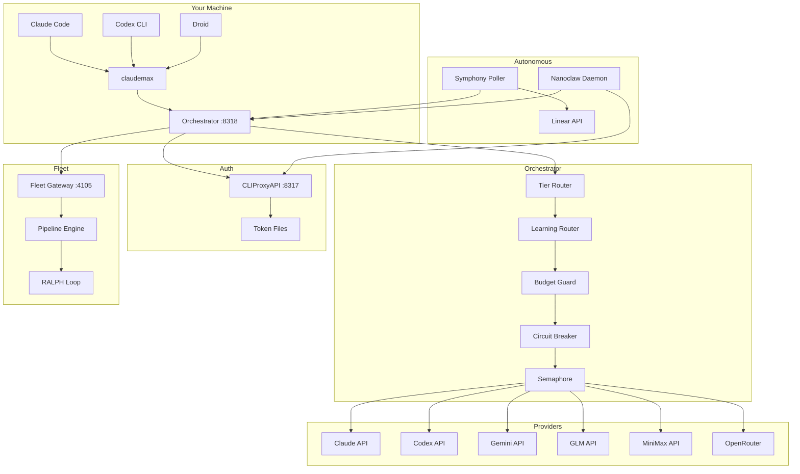
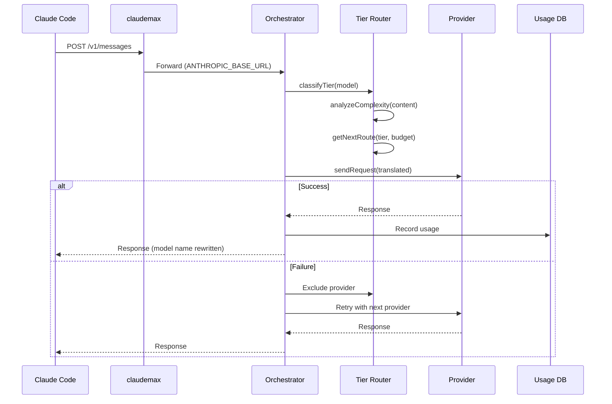
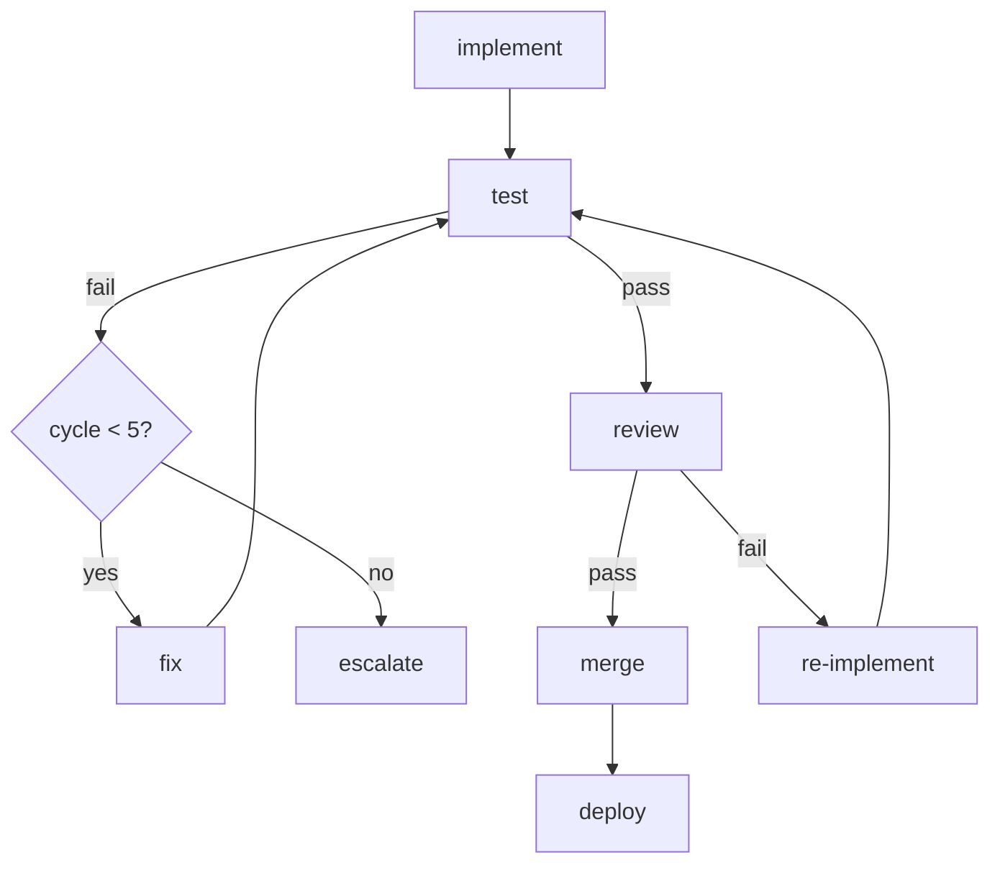
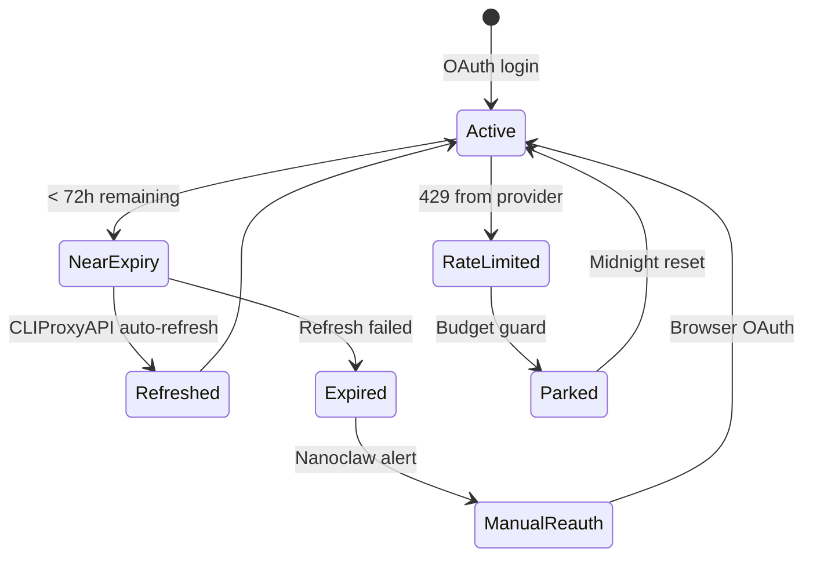
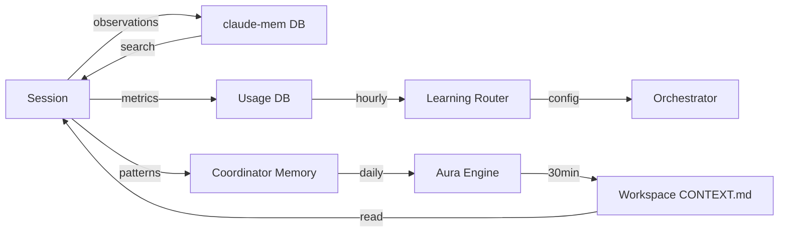

# System Diagrams

Reference diagrams for the full stack. Each shows a different cross-section of the system.

---

## 1. Full System Architecture

The complete component map from CLI client through to providers and autonomous subsystems.

All CLI clients (`claudemax`, Codex, Droid) point to the orchestrator as their `ANTHROPIC_BASE_URL`. The orchestrator handles routing, failover, and translation. CLIProxyAPI is the auth layer - it holds token files and handles OAuth refresh. Fleet Gateway is the dispatch target for pipeline work. Symphony and Nanoclaw are autonomous daemons that run independently and interact with the stack via its HTTP APIs.

---

## 2. Request Flow (Sequence)

A single request from Claude Code to provider and back, including the routing and failover path.

The model name in the response is always rewritten to the name the caller sent. From the caller's perspective, the provider is invisible. Tier classification happens before routing - the router uses both the requested model name and the message content complexity to select the best available route.

---

## 3. RALPH Self-Correction Loop

The pipeline's built-in test-fix-retest cycle. Runs up to 5 times before escalating.

`cycle_count` is the guard. It increments on every pass through the fix→test arc. At 5, the pipeline stops self-correcting and escalates to a human (or Symphony moves the ticket to Backlog). Review failures send the task back to implement, not just fix - they indicate a design problem, not a code defect.

---

## 4. Token Lifecycle

The full state machine for an OAuth token from initial login through expiry, refresh, and manual reauth.

Nanoclaw is the early-warning system. It scans token files every 30 minutes and triggers CLIProxyAPI refresh when any token is within 72 hours of expiry. If refresh fails (e.g., revoked grant), it alerts via Telegram and marks the token as requiring manual reauth. The Parked state applies to accounts that hit their daily budget - they come back automatically at midnight, no manual action needed.

---

## 5. Memory Flow

How observations from a session propagate through the memory subsystems and back into future sessions.

Sessions write to three targets simultaneously: `claude-mem` for semantic observations, the usage DB for routing metrics, and the coordinator memory DB for task patterns. The learning router reads usage DB metrics hourly and adjusts provider weights. Aura reads coordinator patterns daily and rebuilds the workspace `CONTEXT.md`, which is injected at session start. The cycle is: sessions inform memory, memory informs future sessions.
